import { Card, CardGrid } from '@astrojs/starlight/components';

## 框架对比概览

当研究任务需要多个Agent协作时，选择合适的框架：

| 框架 | 核心优势 | 研究用途 | GitHub |
|------|---------|---------|--------|
| **LangChain/LangGraph** | 复杂推理工作流，状态管理 | 多步骤文献分析、实验设计 | [langchain-ai](https://github.com/langchain-ai) |
| **LlamaIndex** | 知识库集成，RAG 优化 | 文档密集型研究、论文库查询 | [run-llama](https://github.com/run-llama) |
| **CrewAI** | 角色定义清晰，企业级 | 协作研究项目、团队模拟 | [crewAIInc](https://github.com/crewAIInc) |
| **Microsoft AutoGen** | 对话优先框架 | 讨论式研究、辩论式分析 | [microsoft/autogen](https://github.com/microsoft/autogen) |

---

## 选择决策树

```mermaid
flowchart TD
    A[任务类型] --> B{需要复杂工作流?}
    A --> C{需要知识库/RAG?}
    A --> D{需要角色扮演?}
    A --> E{需要对话辩论?}

    B -->|是| F[LangGraph]
    B -->|否| G[简单顺序执行]

    C -->|是| H[LlamaIndex]
    D -->|是| I[CrewAI]
    E -->|是| J[AutoGen]

    style F fill:#1a3a1a,stroke:#10a37f
    style H fill:#1a2a3a,stroke:#007aff
    style I fill:#2a1a3a,stroke:#ab68ff
    style J fill:#1a3a2a,stroke:#19c37d
```



---

## 框架详解

### LangGraph - 复杂工作流

**适用场景**：
- 多步骤文献分析流水线
- 复杂推理链构建
- 自定义工具集成

### LlamaIndex - 知识库

**适用场景**：
- 文档密集型研究
- 论文库语义搜索
- 大规模知识管理

### CrewAI - 团队协作

**适用场景**：
- 多角色任务分配
- 结构化工作流
- 企业级研究项目

### AutoGen - 对话框架

**适用场景**：
- 讨论式研究分析
- 辩论式观点验证
- 多视角观点整合

---

## LangGraph 实战：科研状态机

```python
from typing import TypedDict, List, Optional
from langgraph.graph import StateGraph, END

class ResearchState(TypedDict):
    """研究流水线状态"""
    topic: str                          # 研究主题
    papers: List[dict]                  # 论文列表
    analysis: str                       # 当前分析
    gaps: List[str]                     # 识别到的空白
    claims: List[str]                   # 候选主张
    evaluation: str                     # 评估结果

def search_papers(state: ResearchState) -> ResearchState:
    """搜索相关论文"""
    # 使用 Elicit API / Semantic Scholar
    papers = elicit_search(state["topic"])
    return {"papers": papers}

def analyze_papers(state: ResearchState) -> ResearchState:
    """分析论文，提取关键信息"""
    analysis = claude_analyze(state["papers"])
    return {"analysis": analysis}

def extract_gaps(state: ResearchState) -> ResearchState:
    """从分析中提取研究空白"""
    gaps = identify_gaps(state["analysis"])
    return {"gaps": gaps}

def generate_claims(state: ResearchState) -> ResearchState:
    """基于空白生成可验证主张"""
    claims = []
    for gap in state["gaps"]:
        claim = formulate_claim(gap)
        claims.append(claim)
    return {"claims": claims}

def evaluate_claims(state: ResearchState) -> ResearchState:
    """评估主张质量"""
    evaluation = gpt5_evaluate(state["claims"])
    return {"evaluation": evaluation}

# 构建工作流
workflow = StateGraph(ResearchState)

# 添加节点
workflow.add_node("search", search_papers)
workflow.add_node("analyze", analyze_papers)
workflow.add_node("extract_gaps", extract_gaps)
workflow.add_node("generate_claims", generate_claims)
workflow.add_node("evaluate", evaluate_claims)

# 定义边
workflow.add_edge("search", "analyze")
workflow.add_edge("analyze", "extract_gaps")
workflow.add_edge("extract_gaps", "generate_claims")
workflow.add_edge("generate_claims", "evaluate")
workflow.add_edge("evaluate", END)

# 设置入口
workflow.set_entry_point("search")

# 编译
app = workflow.compile()
```

---

## CrewAI 研究团队配置

```python
from crewai import Agent, Task, Crew, Process

# 1. 定义专业角色
literature_reviewer = Agent(
    role="文献综述专家",
    goal="全面梳理指定领域的研究现状",
    backstory="""你是一位经验丰富的研究员，拥有10年AI领域研究经验。
    擅长从海量论文中提取关键信息，识别研究脉络。""",
    tools=[elicit_tool, semantic_scholar_tool],
    verbose=True
)

gap_analyst = Agent(
    role="研究空白分析师",
    goal="从现有研究中识别可探索的空白",
    backstory="""你擅长发现被忽视的研究方向，
    有敏锐的学术嗅觉，能够从细微之处发现创新机会。""",
    tools=[claude_tool],
    verbose=True
)

claim_validator = Agent(
    role="主张验证专家",
    goal="评估研究主张的可验证性和创新性",
    backstory="""你严格审查每一个科学主张，
    要求所有主张都有明确的验证方法和预期结果。""",
    tools=[gpt_tool],
    verbose=True
)

experiment_designer = Agent(
    role="实验设计专家",
    goal="为主张设计可行的验证实验",
    backstory="""你有丰富的实验设计经验，
    擅长设计公平、严谨的验证实验。""",
    tools=[claude_code_tool],
    verbose=True
)

# 2. 定义任务
task_review = Task(
    description="调研 {topic} 领域近3年的顶会论文（ICML/NeurIPS/ICLR），产出：1）研究地图；2）主流方法对比表；3）潜在空白清单",
    expected_output="结构化的研究综述文档",
    agent=literature_reviewer
)

task_gap = Task(
    description="基于文献综述，识别 {topic} 领域最值得探索的5个研究方向，并说明为什么这些方向有价值",
    expected_output="研究空白分析报告",
    agent=gap_analyst
)

task_claim = Task(
    description="将每个研究空白转化为可验证的科研主张（Claim），每个主张必须包含：问题、方法、预期结果",
    expected_output="主张清单及详细说明",
    agent=claim_validator
)

task_experiment = Task(
    description="为每个主张设计具体的验证实验方案，包括：实验设置、评估指标、baselines",
    expected_output="实验设计方案",
    agent=experiment_designer
)

# 3. 组建团队（异步执行）
research_crew = Crew(
    agents=[literature_reviewer, gap_analyst, claim_validator, experiment_designer],
    tasks=[task_review, task_gap, task_claim, task_experiment],
    process=Process.sequential,  # 或 Process.hierarchical
    verbose=True,
    memory=True  # 启用记忆共享
)

# 4. 执行
result = research_crew.kickoff(inputs={"topic": "多模态学习"})
```

---

## AutoGen 对话式研究

```python
import autogen

# 定义对话Agent
critic = autogen.AssistantAgent(
    name="Critic",
    system_message="""你是审稿人Agent，负责批判性分析。
    质疑假设、找出漏洞、提出改进建议。
    每次发言必须提出至少一个建设性批评。"""
)

author = autogen.AssistantAgent(
    name="Author",
    system_message="""你是作者Agent，负责辩护和解释你的研究。
    回应批评，补充论据，完善论点。"""
)

# 启动对话
critic.initiate_chat(
    author,
    message="请简要介绍你的研究主张，然后我会提出质疑。"
)
```

---

## 使用建议

<div class="card-grid">


不要过度设计，Claude Code 单实例足够处理大多数代码任务。


需要状态管理和复杂分支时使用。


论文库/RAG 优先考虑 LlamaIndex。


需要多角色协作时使用，角色定义清晰。


</div>
