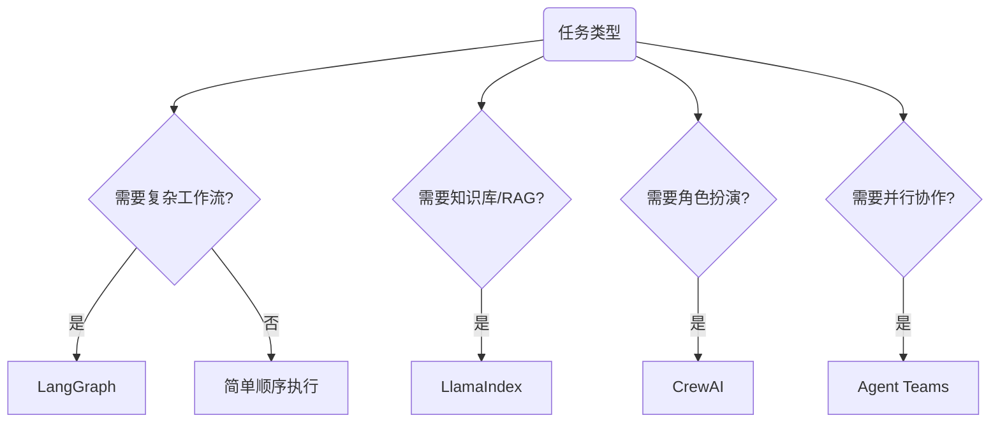

import { Card, CardGrid } from '@astrojs/starlight/components';

## 1. 框架对比概览

当研究任务需要多个Agent协作时，选择合适的框架：

| 框架 | 核心优势 | 研究用途 | GitHub |
|------|---------|---------|--------|
| **LangChain/LangGraph** | 复杂推理工作流，状态管理 | 多步骤文献分析、实验设计 | [langchain-ai](https://github.com/langchain-ai) |
| **LlamaIndex** | 知识库集成，RAG 优化 | 文档密集型研究、论文库查询 | [run-llama](https://github.com/run-llama) |
| **CrewAI** | 角色定义清晰，企业级 | 协作研究项目、团队模拟 | [crewAIInc](https://github.com/crewAIInc) |
| **Microsoft AutoGen** | 对话优先框架 | 讨论式研究、辩论式分析 | [microsoft/autogen](https://github.com/microsoft/autogen) |

---

## 2. 选择决策树



---

## 3. Claude Agent Teams

### 3.1 核心能力

Agent Teams 让多个 Claude Code 会话并行协作：

| 特性 | 说明 |
|------|------|
| **Team lead** | 负责拆解任务、分派、汇总 |
| **Teammates** | 独立执行，各自有上下文窗口 |
| **Delegate mode** | 队长只调度不实现，队友执行 |

### 3.2 两种展示方式

| 模式 | 说明 |
|------|------|
| **In-process** | 都在同一个终端里跑（无需额外配置） |
| **Split panes** | 每个队友一个 pane（需要 tmux 或 iTerm2） |

### 3.3 Agent Teams 四步法

1. **队长会话（Lead）先进入 Plan/Delegate**：先拆任务，不急着写代码
2. 把任务拆成：可并行、低耦合、验收明确的子任务
3. 每个子任务指定：输入、输出、验收（DoD）
4. 队友完成后，Lead 做集成、跑全套测试、开 PR

### 3.4 Claude Code SDK 实战

```python
from claude_code import ClaudeAgent, TaskResult

# 创建并行任务
agents = [
    ClaudeAgent(name="Architect", role="架构设计"),
    ClaudeAgent(name="Implementer", role="核心实现"),
    ClaudeAgent(name="Tester", role="测试验证"),
]

# 并行执行
results = agent_team.run_parallel(agents, task="实现特征提取模块")
```

---

## 4. LangGraph 实战：科研状态机

```python
from typing import TypedDict, List, Optional
from langgraph.graph import StateGraph, END

class ResearchState(TypedDict):
    """研究流水线状态"""
    topic: str                          # 研究主题
    papers: List[dict]                  # 论文列表
    analysis: str                       # 当前分析
    gaps: List[str]                     # 识别到的空白
    claims: List[str]                   # 候选主张
    evaluation: str                     # 评估结果

def search_papers(state: ResearchState) -> ResearchState:
    """搜索相关论文"""
    papers = elicit_search(state["topic"])
    return {"papers": papers}

def analyze_papers(state: ResearchState) -> ResearchState:
    """分析论文，提取关键信息"""
    analysis = claude_analyze(state["papers"])
    return {"analysis": analysis}

def extract_gaps(state: ResearchState) -> ResearchState:
    """从分析中提取研究空白"""
    gaps = identify_gaps(state["analysis"])
    return {"gaps": gaps}

def generate_claims(state: ResearchState) -> ResearchState:
    """基于空白生成可验证主张"""
    claims = []
    for gap in state["gaps"]:
        claim = formulate_claim(gap)
        claims.append(claim)
    return {"claims": claims}

def evaluate_claims(state: ResearchState) -> ResearchState:
    """评估主张质量"""
    evaluation = gpt5_evaluate(state["claims"])
    return {"evaluation": evaluation}

# 构建工作流
workflow = StateGraph(ResearchState)
workflow.add_node("search", search_papers)
workflow.add_node("analyze", analyze_papers)
workflow.add_node("extract_gaps", extract_gaps)
workflow.add_node("generate_claims", generate_claims)
workflow.add_node("evaluate", evaluate_claims)

# 定义边
workflow.add_edge("search", "analyze")
workflow.add_edge("analyze", "extract_gaps")
workflow.add_edge("extract_gaps", "generate_claims")
workflow.add_edge("generate_claims", "evaluate")
workflow.add_edge("evaluate", END)

app = workflow.compile()
```

---

## 5. CrewAI 研究团队配置

```python
from crewai import Agent, Task, Crew, Process

# 1. 定义专业角色
literature_reviewer = Agent(
    role="文献综述专家",
    goal="全面梳理指定领域的研究现状",
    backstory="你是一位经验丰富的研究员，拥有10年AI领域研究经验。",
    tools=[elicit_tool, semantic_scholar_tool],
    verbose=True
)

gap_analyst = Agent(
    role="研究空白分析师",
    goal="从现有研究中识别可探索的空白",
    backstory="你擅长发现被忽视的研究方向。",
    tools=[claude_tool],
    verbose=True
)

claim_validator = Agent(
    role="主张验证专家",
    goal="评估研究主张的可验证性和创新性",
    backstory="你严格审查每一个科学主张。",
    tools=[gpt_tool],
    verbose=True
)

# 2. 定义任务
task_review = Task(
    description="调研 {topic} 领域近3年的顶会论文，产出：1）研究地图；2）主流方法对比表；3）潜在空白清单",
    expected_output="结构化的研究综述文档",
    agent=literature_reviewer
)

task_gap = Task(
    description="基于文献综述，识别 {topic} 领域最值得探索的5个研究方向",
    expected_output="研究空白分析报告",
    agent=gap_analyst
)

task_claim = Task(
    description="将每个研究空白转化为可验证的科研主张",
    expected_output="主张清单及详细说明",
    agent=claim_validator
)

# 3. 组建团队
research_crew = Crew(
    agents=[literature_reviewer, gap_analyst, claim_validator],
    tasks=[task_review, task_gap, task_claim],
    process=Process.sequential,
    verbose=True,
    memory=True
)

result = research_crew.kickoff(inputs={"topic": "多模态学习"})
```

---

## 6. AutoGen 对话式研究

```python
import autogen

# 定义对话Agent
critic = autogen.AssistantAgent(
    name="Critic",
    system_message="""你是审稿人Agent，负责批判性分析。
    质疑假设、找出漏洞、提出改进建议。
    每次发言必须提出至少一个建设性批评。"""
)

author = autogen.AssistantAgent(
    name="Author",
    system_message="""你是作者Agent，负责辩护和解释你的研究。
    回应批评，补充论据，完善论点。"""
)

# 启动对话
critic.initiate_chat(
    author,
    message="请简要介绍你的研究主张，然后我会提出质疑。"
)
```

---

## 7. Ralph 循环：简单而强大的自治模式

### 7.1 核心原理

Ralph 循环通过简单的 bash 循环重复执行操作，直到任务成功：

```bash
#!/usr/bin/env bash
set -euo pipefail

MAX_ITERS="${MAX_ITERS:-25}"

for i in $(seq 1 "$MAX_ITERS"); do
  echo "=== Iteration $i/$MAX_ITERS ==="
  cat PROMPT.md | claude -p "按PROMPT.md完成任务。必须跑 tests；失败要修到通过。"
  ./scripts/test-fast.sh && ./scripts/lint.sh
done

echo "Reached MAX_ITERS=$MAX_ITERS without passing. Stop."
exit 1
```

### 7.2 关键技巧

| 技巧 | 说明 |
|------|------|
| **明确完成标准** | 定义可验证的完成条件（测试通过、无错误） |
| **小迭代原则** | 每轮迭代只处理少量任务 |
| **反馈循环** | 集成自动化检查确保每轮结果有效 |
| **安全限制** | 设置迭代次数上限（20-50次） |

### 7.3 适用场景

| 适合 | 不适合 |
|------|--------|
| 可量化、可验证的任务 | 探索性任务 |
| 重构、写测试、文档化 | 主观设计 |
| 补测试、修复 Bug | 安全敏感代码 |

---

## 8. 实战案例：16 个 Claude 写 C 编译器

### 8.1 实验概览

- **目标**：让 16 个 Claude 并行开发一个能编译 Linux 内核的 C 编译器
- **成果**：两周内，近 2000 次会话，$2 万成本，10 万行代码
- **支持架构**：x86、ARM、RISC-V

### 8.2 成功的关键

1. **极高质量的测试体系**：引入成熟测试集，CI 强制要求新提交不破坏功能
2. **站在 AI 视角设计系统**：
   - 简化测试输出，结构化日志便于 AI 检索
   - 提供 `--fast` 模式只运行 1%-10% 测试子集
3. **确保任务可拆分**：让每个智能体修复独立测试用例
4. **利用并行实现角色分工**：性能优化、代码重构、文档维护

---

## 9. Everything Claude Code 项目

### 9.1 项目概览

| 项目 | 说明 |
|------|------|
| **创建者** | Anthropic 黑客松冠军 Affaan Mustafa |
| **定位** | 完整配置集合，将 Claude 升级为"虚拟开发团队" |
| **GitHub** | [affaan-m/everything-claude-code](https://github.com/affaan-m/everything-claude-code) |

### 9.2 核心组件

| 组件 | 功能 |
|------|------|
| **Agents** | 规划、代码审查、安全检测、TDD 指导 |
| **Skills** | 工作流和领域经验封装 |
| **Commands** | 快速执行预定义流程 |
| **Rules** | 开发规范、测试覆盖率要求 |
| **Hooks** | 提交前检查、console.log 检测 |
| **MCP** | 外部工具连接 |

### 9.3 实战效果

| 指标 | 提升 |
|------|------|
| 功能实现速度 | 65% |
| 代码问题减少 | 75% |
| 测试覆盖率 | 82% |
| 会话切换减少 | 70% |

---

## 10. 多终端并行配置

### 10.1 tmux 工作流

```bash
# 安装 tmux (macOS)
brew install tmux

# 配置文件 ~/.tmux.conf
set -g mouse on
bind-key C-d set -g mouse on

# 一键启动多 AI 模型
./start-ai-agents.sh
```

### 10.2 多模型同步控制

| 快捷键 | 功能 |
|--------|------|
| `Ctrl+b D` | 切换同步模式 |
| `Ctrl+b X` | 退出多窗口模式 |

### 10.3 适用场景

- **同时对比**：Claude、Codex、Gemini、OpenCode
- **并行实现**：多个 worktree 同时推进
- **多视角评审**：一个实现、一个审查、一个测试

---

## 11. 使用建议

<CardGrid>

<Card title="简单优先">

不要过度设计，Claude Code 单实例足够处理大多数代码任务。

</Card>

<Card title="状态管理">

需要复杂分支时使用 LangGraph 或 Agent Teams。

</Card>

<Card title="RAG 场景">

论文库查询优先考虑 LlamaIndex。

</Card>

<Card title="多角色">

需要角色扮演时使用 CrewAI。

</Card>

</CardGrid>

---

## 12. Execution-Grounded Agent 实战要点

为了让多 Agent 真正用于科研而不只是"写建议"，建议采用 execution-grounded 架构：

1. **Idea Agent**：提出可执行改动（不是抽象口号）
2. **Patch Agent**：输出可应用的代码 diff
3. **Executor Agent**：在标准环境中自动训练/评测（含 GPU 资源调度）
4. **Feedback Agent**：回收 Wandb/日志结果，驱动下一轮搜索

### 12.1 两类标准化环境

| 环境 | 典型配置 |
|------|---------|
| **Post-training** | GRPO + MATH |
| **Pre-training** | nanoGPT + FineWeb |

这种环境化设计的价值：
- 可以批量并行比较 idea，不依赖主观判断
- 可以把"创新性"转化为"可执行且可复验"的工程流程
- 可以把失败样本积累为后续搜索的先验约束

---

## 13. AI Scientist 系列脉络（补充）

为避免把自动化科研理解成“单一框架”，这里补一条系列演进视角（来自 `AI research.md`）：

| 路线 | 核心特点 | 对工程落地的启发 |
|------|---------|------------------|
| **AI Scientist (早期)** | 自动生成 idea 与初步实验 | 适合快速探索，但执行闭环较弱 |
| **Execution-Grounded 路线** | 强调 patch/run/feedback 闭环 | 更适合做真实迭代与可复现实验 |
| **Narrative 路线（Idea2Story）** | 从想法到完整论文叙事 | 适合写作联动与产出打磨 |

实操建议：把三条路线合成“探索 → 执行 → 叙事”的分层流程，而不是把某一个框架当万能解。

---

## 14. Book 实战增补（逐篇并入）

> 本节并入 3 篇与多 Agent 协作强相关的文章，统一为"何时用团队协作、如何控成本、如何防跑偏"的实操框架。

### 14.1 1) Agent Swarm（蜂群）实战：从单助手到数字团队

#### 14.1.1 核心机制（可落地）

1. **共享任务列表**：统一看板，便于并行认领和状态同步。
2. **消息邮箱系统**：队员间可直接通信，减少 Lead 中转瓶颈。
3. **独立上下文**：每个 Agent 独立窗口，避免大任务互相污染。

#### 14.1.2 六种典型玩法（按成熟度）

- 新手：提示词里显式要求“尽可能拆分并行 + 尽可能调用 skill”。
- 进阶：主模型统筹，便宜模型执行（文档/测试等）做成本分层。
- 复用：优先搜索社区 skill，找不到再降级到本地或通用流程。
- 降返工：先计划、后评审、再执行，卡住就回到计划阶段。
- 大项目：Lead-Member 架构，分角色并行交付。
- 深水区：Hooks/动态路由/Subagent Fork 等做质量与成本精调。

#### 14.1.3 详细步骤（从 0 开始跑 Swarm）

1. 先写任务卡：目标、范围、交付物、验收标准（四项缺一不可）。
2. 指定 Lead 只做拆解与验收，不直接写核心实现代码。
3. 把任务拆成并行子任务（每个子任务都要有独立输入输出）。
4. 要求每个成员用统一汇报模板：完成项 / 风险 / 下一步。
5. Lead 在每个里程碑做一次冲突检查（文件冲突、接口冲突、依赖冲突）。
6. 最后统一跑集成验证，再回到主分支合并。

#### 14.1.4 文章细节补充（Swarm 六玩法模板）

##### 玩法1：新手并行提示模板

```text
调用 Agent Swarm 执行任务：<任务描述>
要求：
1) 尽可能拆分并行子任务
2) 优先使用已安装 skills
3) 每个子任务输出“结果+风险+下一步”
```

##### 玩法2：跨模型协作（成本分层）

- 复杂架构/核心逻辑：强模型；
- 文档/测试/样板代码：低成本模型；
- 最终合并与验收：回到主模型统一把关。

##### 玩法3：社区 Skill 复用

1. 先搜索可用 skill；
2. 匹配则直接调用；
3. 无匹配再降级到通用流程。

##### 玩法4：计划+评审循环

1. 先产 Todo 与依赖；
2. 评审 agent 指出遗漏与风险；
3. 评审通过后才并行执行。

##### 玩法5：Lead-Member 组织结构

- Lead：任务拆解、里程碑验收；
- Members：按角色并行实现；
- 里程碑结束统一集成。

##### 玩法6：高级功能组合

- Hooks 做质量门禁；
- 动态模型路由控成本；
- Subagent Fork 隔离上下文污染。

#### 14.1.5 实战摘录

> Swarm 不是"更会聊天"，而是"可协作的生产组织"。核心收益来自任务拆解质量，而不是 agent 数量。

### 14.2 2) Agent Teams 团战模式：并行收益与协调成本

#### 14.2.1 适用/不适用边界

| 任务类型 | 建议 |
|---|---|
| 研究审查、多假设调试、跨层联动 | 优先 Agent Teams |
| 顺序任务、同文件高冲突、强依赖链 | 优先单会话或 Subagent |

#### 14.2.2 启用与操作要点

```json
{
  "env": {
    "CLAUDE_CODE_EXPERIMENTAL_AGENT_TEAMS": "1"
  }
}
```

- 启用后先定义：Lead 职责、队员分工、里程碑验收。
- 明确要求：`Wait for teammates before proceeding`，避免 Lead 抢做。
- 文件级分工防冲突：每个队员拥有独立文件集。
- 控 token：团队规模与任务收益匹配，避免“并行过度”。

#### 14.2.3 详细步骤（Agent Teams 落地）

1. 在 `settings.json` 打开 `CLAUDE_CODE_EXPERIMENTAL_AGENT_TEAMS=1`。
2. 重启会话，确认团队模式已可用（可看到 team/teammates 指令反馈）。
3. 创建团队时先给角色定义：Lead、Frontend、Backend、Test、Docs。
4. 给每个角色分配**不重叠文件域**，防止写冲突。
5. 执行中每 20~30 分钟做一次状态同步：完成/阻塞/待协作。
6. 收尾时执行“等待队员完成”策略，再统一集成测试。

#### 14.2.4 文章细节补充（Teams 全流程）

1. 升级到支持 Teams 的版本（必要时先执行更新命令）。
2. 在 `settings.json` 注入实验开关并重启会话。
3. 选择显示模式（同进程或分屏），确认可观察到每个成员状态。
4. 指定成员角色与模型，给每个成员写明 DoD（Definition of Done）。
5. 启用委托模式，Lead 不直接写实现。
6. 执行阶段每轮只推进一个里程碑，防止团队漂移。
7. 全部成员完成后再统一回归测试与文档收口。

#### 14.2.5 限制说明（实操前必读）

- 每会话仅一个团队；
- 不支持嵌套团队；
- 进程内成员恢复能力有限；
- 分屏依赖终端能力（tmux/iTerm2 等）。

### 14.3 3) 进阶实战（Skills/Subagents/MCP 组合）

#### 14.3.1 组合原则

- **Skill**：固化团队规则与复用流程（先描述触发条件，后写具体动作）。
- **Subagent**：把高噪声探索外包，主上下文只保留摘要结论。
- **MCP**：把外部系统接入同一会话，减少标签页切换与复制粘贴。

#### 14.3.2 Subagent 设计建议

- 明确 `description` 与输出格式，避免“回传整段上下文”。
- 只给必要工具权限（只读审查与可写实现分离）。
- 推荐链路：Explore → Implementer → Tester，主代理只做整合与决策。

#### 14.3.3 详细步骤（Subagents + MCP 组合）

1. 先定义 Explore 输出格式：只返回“文件路径 + 关键结论 + 风险点”。
2. Implementer 仅接收结构化输入，不接收原始长对话。
3. Tester 固定执行同一套测试清单，结果以表格返回。
4. 主代理整合三者输出后，再调用 MCP 写回 issue/文档系统。
5. 若发现信息漂移，回滚到 Explore 结果重建链路，不在末端硬修。

#### 14.3.4 文章细节补充（命令级落地）

```bash
# 查看可用 subagents
/agents

# 查看 MCP 连接
/mcp

# 示例：添加 HTTP MCP（按实际服务替换）
claude mcp add --transport http notion https://mcp.notion.com/mcp
```

1. 先建只读 `security-reviewer`，限制到 Read/Grep/Glob。
2. 再建可写 implementer，明确只改指定目录。
3. 所有 subagent 返回统一格式：`summary / changed_files / risks`。
4. MCP 只接入本任务必要服务，避免权限过大。

#### 14.3.5 MCP 使用建议

- 优先接入：GitHub、Slack、DB、文档系统。
- 第三方连接器先做安全评估（权限、日志、凭证范围）。
- 通过 `/mcp` 定期盘点已加载连接，避免“隐式工具漂移”。

#### 14.3.6 常见坑与处理

- **坑1：并行太多导致 token 爆涨** → 限制活跃队员数量，优先高价值并行。
- **坑2：成员写同一文件互相覆盖** → 启动前做文件分区。
- **坑3：Lead 抢做实现导致协作失效** → 明确 Lead 只做调度与验收。
- **坑4：总结过长污染主上下文** → 强制摘要长度与格式。
