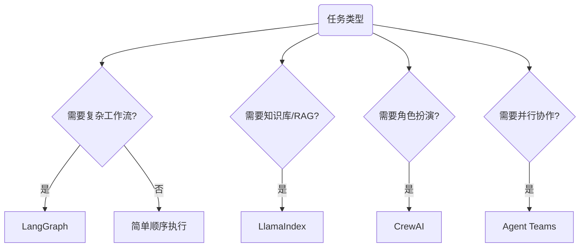

import { Card, CardGrid } from '@astrojs/starlight/components';

## 框架对比概览

当研究任务需要多个Agent协作时，选择合适的框架：

| 框架 | 核心优势 | 研究用途 | GitHub |
|------|---------|---------|--------|
| **LangChain/LangGraph** | 复杂推理工作流，状态管理 | 多步骤文献分析、实验设计 | [langchain-ai](https://github.com/langchain-ai) |
| **LlamaIndex** | 知识库集成，RAG 优化 | 文档密集型研究、论文库查询 | [run-llama](https://github.com/run-llama) |
| **CrewAI** | 角色定义清晰，企业级 | 协作研究项目、团队模拟 | [crewAIInc](https://github.com/crewAIInc) |
| **Microsoft AutoGen** | 对话优先框架 | 讨论式研究、辩论式分析 | [microsoft/autogen](https://github.com/microsoft/autogen) |

---

## 选择决策树



---

## Claude Agent Teams

### 核心能力

Agent Teams 让多个 Claude Code 会话并行协作：

| 特性 | 说明 |
|------|------|
| **Team lead** | 负责拆解任务、分派、汇总 |
| **Teammates** | 独立执行，各自有上下文窗口 |
| **Delegate mode** | 队长只调度不实现，队友执行 |

### 两种展示方式

| 模式 | 说明 |
|------|------|
| **In-process** | 都在同一个终端里跑（无需额外配置） |
| **Split panes** | 每个队友一个 pane（需要 tmux 或 iTerm2） |

### Agent Teams 四步法

1. **队长会话（Lead）先进入 Plan/Delegate**：先拆任务，不急着写代码
2. 把任务拆成：可并行、低耦合、验收明确的子任务
3. 每个子任务指定：输入、输出、验收（DoD）
4. 队友完成后，Lead 做集成、跑全套测试、开 PR

### Claude Code SDK 实战

```python
from claude_code import ClaudeAgent, TaskResult

# 创建并行任务
agents = [
    ClaudeAgent(name="Architect", role="架构设计"),
    ClaudeAgent(name="Implementer", role="核心实现"),
    ClaudeAgent(name="Tester", role="测试验证"),
]

# 并行执行
results = agent_team.run_parallel(agents, task="实现特征提取模块")
```

---

## LangGraph 实战：科研状态机

```python
from typing import TypedDict, List, Optional
from langgraph.graph import StateGraph, END

class ResearchState(TypedDict):
    """研究流水线状态"""
    topic: str                          # 研究主题
    papers: List[dict]                  # 论文列表
    analysis: str                       # 当前分析
    gaps: List[str]                     # 识别到的空白
    claims: List[str]                   # 候选主张
    evaluation: str                     # 评估结果

def search_papers(state: ResearchState) -> ResearchState:
    """搜索相关论文"""
    papers = elicit_search(state["topic"])
    return {"papers": papers}

def analyze_papers(state: ResearchState) -> ResearchState:
    """分析论文，提取关键信息"""
    analysis = claude_analyze(state["papers"])
    return {"analysis": analysis}

def extract_gaps(state: ResearchState) -> ResearchState:
    """从分析中提取研究空白"""
    gaps = identify_gaps(state["analysis"])
    return {"gaps": gaps}

def generate_claims(state: ResearchState) -> ResearchState:
    """基于空白生成可验证主张"""
    claims = []
    for gap in state["gaps"]:
        claim = formulate_claim(gap)
        claims.append(claim)
    return {"claims": claims}

def evaluate_claims(state: ResearchState) -> ResearchState:
    """评估主张质量"""
    evaluation = gpt5_evaluate(state["claims"])
    return {"evaluation": evaluation}

# 构建工作流
workflow = StateGraph(ResearchState)
workflow.add_node("search", search_papers)
workflow.add_node("analyze", analyze_papers)
workflow.add_node("extract_gaps", extract_gaps)
workflow.add_node("generate_claims", generate_claims)
workflow.add_node("evaluate", evaluate_claims)

# 定义边
workflow.add_edge("search", "analyze")
workflow.add_edge("analyze", "extract_gaps")
workflow.add_edge("extract_gaps", "generate_claims")
workflow.add_edge("generate_claims", "evaluate")
workflow.add_edge("evaluate", END)

app = workflow.compile()
```

---

## CrewAI 研究团队配置

```python
from crewai import Agent, Task, Crew, Process

# 1. 定义专业角色
literature_reviewer = Agent(
    role="文献综述专家",
    goal="全面梳理指定领域的研究现状",
    backstory="你是一位经验丰富的研究员，拥有10年AI领域研究经验。",
    tools=[elicit_tool, semantic_scholar_tool],
    verbose=True
)

gap_analyst = Agent(
    role="研究空白分析师",
    goal="从现有研究中识别可探索的空白",
    backstory="你擅长发现被忽视的研究方向。",
    tools=[claude_tool],
    verbose=True
)

claim_validator = Agent(
    role="主张验证专家",
    goal="评估研究主张的可验证性和创新性",
    backstory="你严格审查每一个科学主张。",
    tools=[gpt_tool],
    verbose=True
)

# 2. 定义任务
task_review = Task(
    description="调研 {topic} 领域近3年的顶会论文，产出：1）研究地图；2）主流方法对比表；3）潜在空白清单",
    expected_output="结构化的研究综述文档",
    agent=literature_reviewer
)

task_gap = Task(
    description="基于文献综述，识别 {topic} 领域最值得探索的5个研究方向",
    expected_output="研究空白分析报告",
    agent=gap_analyst
)

task_claim = Task(
    description="将每个研究空白转化为可验证的科研主张",
    expected_output="主张清单及详细说明",
    agent=claim_validator
)

# 3. 组建团队
research_crew = Crew(
    agents=[literature_reviewer, gap_analyst, claim_validator],
    tasks=[task_review, task_gap, task_claim],
    process=Process.sequential,
    verbose=True,
    memory=True
)

result = research_crew.kickoff(inputs={"topic": "多模态学习"})
```

---

## AutoGen 对话式研究

```python
import autogen

# 定义对话Agent
critic = autogen.AssistantAgent(
    name="Critic",
    system_message="""你是审稿人Agent，负责批判性分析。
    质疑假设、找出漏洞、提出改进建议。
    每次发言必须提出至少一个建设性批评。"""
)

author = autogen.AssistantAgent(
    name="Author",
    system_message="""你是作者Agent，负责辩护和解释你的研究。
    回应批评，补充论据，完善论点。"""
)

# 启动对话
critic.initiate_chat(
    author,
    message="请简要介绍你的研究主张，然后我会提出质疑。"
)
```

---

## Ralph 循环：简单而强大的自治模式

### 核心原理

Ralph 循环通过简单的 bash 循环重复执行操作，直到任务成功：

```bash
#!/usr/bin/env bash
set -euo pipefail

MAX_ITERS="${MAX_ITERS:-25}"

for i in $(seq 1 "$MAX_ITERS"); do
  echo "=== Iteration $i/$MAX_ITERS ==="
  cat PROMPT.md | claude -p "按PROMPT.md完成任务。必须跑 tests；失败要修到通过。"
  ./scripts/test-fast.sh && ./scripts/lint.sh
done

echo "Reached MAX_ITERS=$MAX_ITERS without passing. Stop."
exit 1
```

### 关键技巧

| 技巧 | 说明 |
|------|------|
| **明确完成标准** | 定义可验证的完成条件（测试通过、无错误） |
| **小迭代原则** | 每轮迭代只处理少量任务 |
| **反馈循环** | 集成自动化检查确保每轮结果有效 |
| **安全限制** | 设置迭代次数上限（20-50次） |

### 适用场景

| 适合 | 不适合 |
|------|--------|
| 可量化、可验证的任务 | 探索性任务 |
| 重构、写测试、文档化 | 主观设计 |
| 补测试、修复 Bug | 安全敏感代码 |

---

## 实战案例：16 个 Claude 写 C 编译器

### 实验概览

- **目标**：让 16 个 Claude 并行开发一个能编译 Linux 内核的 C 编译器
- **成果**：两周内，近 2000 次会话，$2 万成本，10 万行代码
- **支持架构**：x86、ARM、RISC-V

### 成功的关键

1. **极高质量的测试体系**：引入成熟测试集，CI 强制要求新提交不破坏功能
2. **站在 AI 视角设计系统**：
   - 简化测试输出，结构化日志便于 AI 检索
   - 提供 `--fast` 模式只运行 1%-10% 测试子集
3. **确保任务可拆分**：让每个智能体修复独立测试用例
4. **利用并行实现角色分工**：性能优化、代码重构、文档维护

---

## Everything Claude Code 项目

### 项目概览

| 项目 | 说明 |
|------|------|
| **创建者** | Anthropic 黑客松冠军 Affaan Mustafa |
| **定位** | 完整配置集合，将 Claude 升级为"虚拟开发团队" |
| **GitHub** | [affaan-m/everything-claude-code](https://github.com/affaan-m/everything-claude-code) |

### 核心组件

| 组件 | 功能 |
|------|------|
| **Agents** | 规划、代码审查、安全检测、TDD 指导 |
| **Skills** | 工作流和领域经验封装 |
| **Commands** | 快速执行预定义流程 |
| **Rules** | 开发规范、测试覆盖率要求 |
| **Hooks** | 提交前检查、console.log 检测 |
| **MCP** | 外部工具连接 |

### 实战效果

| 指标 | 提升 |
|------|------|
| 功能实现速度 | 65% |
| 代码问题减少 | 75% |
| 测试覆盖率 | 82% |
| 会话切换减少 | 70% |

---

## 多终端并行配置

### tmux 工作流

```bash
# 安装 tmux (macOS)
brew install tmux

# 配置文件 ~/.tmux.conf
set -g mouse on
bind-key C-d set -g mouse on

# 一键启动多 AI 模型
./start-ai-agents.sh
```

### 多模型同步控制

| 快捷键 | 功能 |
|--------|------|
| `Ctrl+b D` | 切换同步模式 |
| `Ctrl+b X` | 退出多窗口模式 |

### 适用场景

- **同时对比**：Claude、Codex、Gemini、OpenCode
- **并行实现**：多个 worktree 同时推进
- **多视角评审**：一个实现、一个审查、一个测试

---

## 使用建议

<CardGrid>

<Card title="简单优先">

不要过度设计，Claude Code 单实例足够处理大多数代码任务。

</Card>

<Card title="状态管理">

需要复杂分支时使用 LangGraph 或 Agent Teams。

</Card>

<Card title="RAG 场景">

论文库查询优先考虑 LlamaIndex。

</Card>

<Card title="多角色">

需要角色扮演时使用 CrewAI。

</Card>

</CardGrid>

---

## Execution-Grounded Agent 实战要点

为了让多 Agent 真正用于科研而不只是"写建议"，建议采用 execution-grounded 架构：

1. **Idea Agent**：提出可执行改动（不是抽象口号）
2. **Patch Agent**：输出可应用的代码 diff
3. **Executor Agent**：在标准环境中自动训练/评测（含 GPU 资源调度）
4. **Feedback Agent**：回收 Wandb/日志结果，驱动下一轮搜索

### 两类标准化环境

| 环境 | 典型配置 |
|------|---------|
| **Post-training** | GRPO + MATH |
| **Pre-training** | nanoGPT + FineWeb |

这种环境化设计的价值：
- 可以批量并行比较 idea，不依赖主观判断
- 可以把"创新性"转化为"可执行且可复验"的工程流程
- 可以把失败样本积累为后续搜索的先验约束
