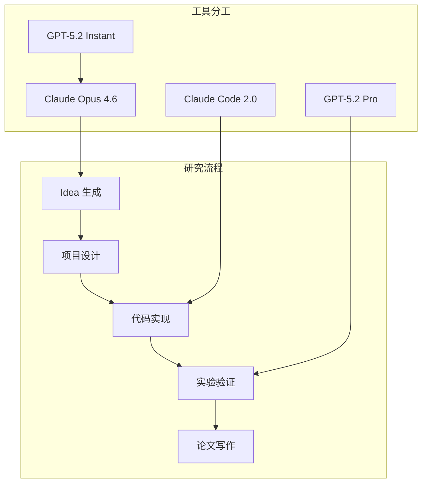

import { Card, CardGrid } from '@astrojs/starlight/components';

## GPT-5.2 系列概览

GPT-5.2 系列（2025年12月发布）适合做**细节 review**和**深度分析**。

### 模型选择矩阵

| 模型 | 特点 | 适用场景 | 定价 |
|------|------|---------|------|
| **GPT-5.2 Instant** | 快速响应，延迟低 | 日常代码辅助、快速问答 | 低 |
| **GPT-5.2 Thinking** | 深度推理，复杂分析 | 复杂问题分析、算法设计 | 中 |
| **GPT-5.2 Pro** | 最强专业版 | 关键代码审查、论文评审 | 高 |

---

## 核心能力

### 基准测试

| 能力 | 数据 | 说明 |
|------|------|------|
| **ARC-AGI-1** | 90%+ | 首次突破 90% 通用推理基准 |
| **知识截止** | 2025年8月 | 支持最新研究成果 |
| **长上下文** | 1M+ tokens | 支持大型文档分析 |

---

## 科研使用场景

<div class="card-grid">


验证代码接口设计是否一致，避免隐藏的 API 变更。


检查实验设置是否公平，baseline 对比是否合理。


发现数据泄漏、指标计算错误等隐蔽问题。


代码审查，发现潜在边界条件和异常情况。


确保评测脚本正确实现，无实现偏差。


独立复现核心实验，验证结果可复现性。


</div>

---

## 与 Claude 的配合策略



| 任务 | 推荐工具 | 理由 |
|------|---------|------|
| 项目架构设计 | Claude Opus 4.6 | 长上下文，200K tokens |
| 代码实现 | Claude Code 2.0 | SWE-bench 80.9% |
| 细节审查 | GPT-5.2 Pro | ARC-AGI 90%+，深度推理 |
| 快速问答 | GPT-5.2 Instant | 响应速度快 |
| 漏洞检测 | GPT-5.2 Thinking | 深度推理能力 |
| 文献调研 | Claude + Elicit | 自动化综述能力 |

---

## 项目文档生成流程

### 步骤 1: 生成项目基准文档

将 idea 交给 GPT Pro/Thinking，让其生成可用的项目文档：

```markdown
# 项目基准文档模板

## 0. 一页速览（30秒读懂）
[核心问题 + 核心贡献]

## 1. 研究问题与动机（Problem Statement）
- 解决什么问题？
- 为什么这个问题重要？

## 2. 相关工作地图（Related Work Map）
- 领域分类
- 主要方法
- 你的定位

## 3. 核心研究假设与可验证主张（Claims）
- Claim 1: [必须对应实验]
- Claim 2: [必须对应实验]

## 4. 形式化（Problem Formulation）
[数学形式化]

## 5. 系统设计（System Architecture）
[架构图 + 模块说明]

## 6. 学习目标（Learning Objective）
[损失函数 + 优化目标]

## 7. 实验与评测（Experiments）
- 主实验
- 消融实验
- 压力测试

## 8. 预期贡献（Expected Outcome）
- 论文贡献点
- 潜在影响

## 9. 风险与备选（Risks & Alternatives）
- 最大风险
- Plan B
```

### 步骤 2: 人工 Review

- 主要看"claim-实验对齐"
- baseline 是否足够强
- 是否有致命假设

**关键问题**：
- 哪些段落最容易被审稿人抓住？
- 哪些实验设计不够严谨？
- 哪些 claim 缺证据？

### 步骤 3: 生成执行文档

再次交给 GPT Pro/Thinking，生成专门给 Claude Code 用的**执行文档**（更偏工程步骤与任务拆分）。

### 步骤 4: 迭代到稳定

用这种方式迭代到文档稳定为止。

---

## 最佳实践

<div class="tip">

**GPT-5.2 核心优势**：深度推理能力，特别适合发现隐藏假设和逻辑漏洞。

</div>

### 使用建议

1. **不要用它写代码**：Claude Code 在代码任务上更强
2. **用它做审查**：让它找 bug、提质疑
3. **用它做分析**：让它分析论文、发现逻辑问题
4. **多用它的 Thinking 模式**：深度推理输出更可靠
