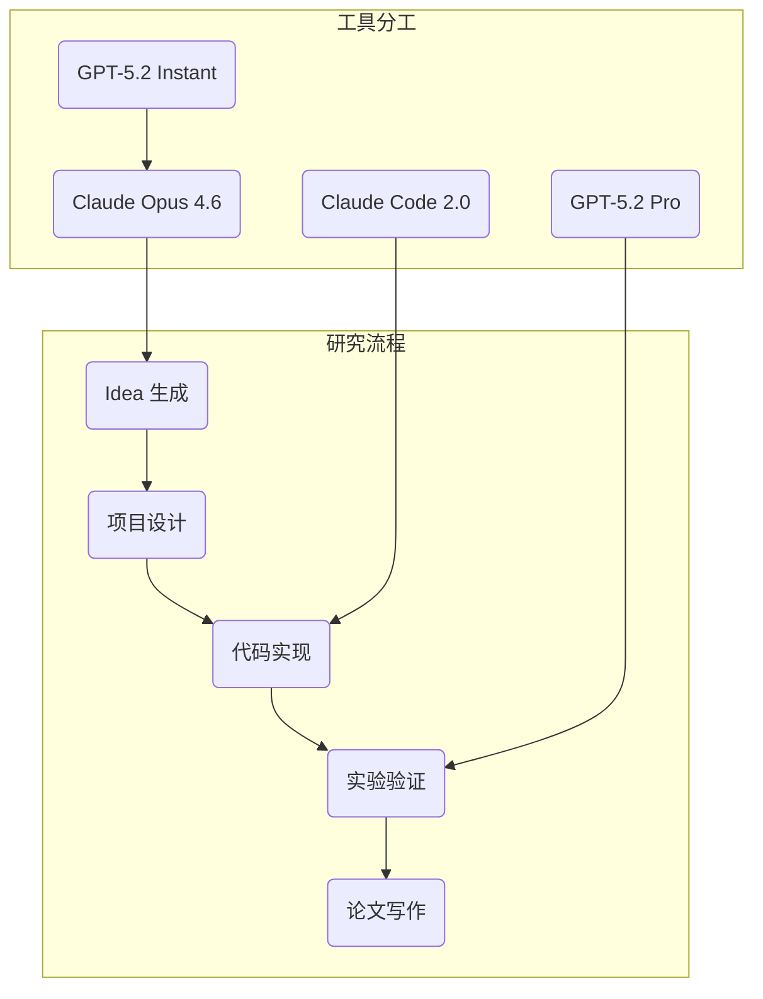

import { Card, CardGrid } from '@astrojs/starlight/components';

## 1. GPT-5.2 系列概览

GPT-5.2 系列（2025年12月发布）适合做**细节 review**和**深度分析**。

### 1.1 模型选择矩阵

| 模型 | 特点 | 适用场景 | 定价 |
|------|------|---------|------|
| **GPT-5.2 Instant** | 快速响应，延迟低 | 日常代码辅助、快速问答 | 低 |
| **GPT-5.2 Thinking** | 深度推理，复杂分析 | 复杂问题分析、算法设计 | 中 |
| **GPT-5.2 Pro** | 最强专业版 | 关键代码审查、论文评审 | 高 |

---

## 2. 核心能力

### 2.1 基准测试

| 能力 | 数据 | 说明 |
|------|------|------|
| **ARC-AGI-1** | 90%+ | 首次突破 90% 通用推理基准 |
| **知识截止** | 2025年8月 | 支持最新研究成果 |
| **长上下文** | 1M+ tokens | 支持大型文档分析 |

---

## 3. GPT-5.3-Codex 核心升级

### 3.1 核心特性

| 特性 | 数据 | 说明 |
|------|------|------|
| **自我参与开发** | - | 早期版本加速自身开发 |
| **速度提升** | 25%+ | 比前代快 25% |
| **Token 减半** | 50% | 相同任务所需 token 减半 |
| **训练速度** | 4x | 训练速度提升 4 倍 |

### 3.2 性能优势

| 基准 | 得分 | 说明 |
|------|------|------|
| **Terminal-Bench 2.0** | 77.3% | 智能体编码领先 |
| **OSWorld** | 64.7% | 桌面自动化领先 |
| **网络安全** | High 级别 | OpenAI 首个获评 |

---

## 4. Claude Opus 4.6 vs GPT-5.3-Codex

### 4.1 核心对比

| 维度 | Claude Opus 4.6 | GPT-5.3-Codex |
|------|-----------------|---------------|
| **上下文窗口** | 100万 tokens (Beta) | 400K tokens |
| **复杂知识工作** | 更强 | 稍弱 |
| **自主编码任务** | 稍弱 | 更强 |
| **发展方向** | 广度（多智能体、Office） | 深度（效率、交互性） |

### 4.2 适用场景选择

<CardGrid>

<Card title="选择 Claude">

- 需要处理大型代码库
- 多智能体协作任务
- 需要 Office 集成
- 复杂知识工作

</Card>

<Card title="选择 Codex">

- 追求极致的编码效率
- 需要快速迭代
- 交互式引导需求
- 自主编码和自动化任务

</Card>

</CardGrid>

---

## 5. 科研使用场景

<div class="card-grid">


验证代码接口设计是否一致，避免隐藏的 API 变更。


检查实验设置是否公平，baseline 对比是否合理。


发现数据泄漏、指标计算错误等隐蔽问题。


代码审查，发现潜在边界条件和异常情况。


确保评测脚本正确实现，无实现偏差。


独立复现核心实验，验证结果可复现性。


</div>

---

## 6. 与 Claude 的配合策略



| 任务 | 推荐工具 | 理由 |
|------|---------|------|
| 项目架构设计 | Claude Opus 4.6 | 长上下文，200K tokens |
| 代码实现 | Claude Code 2.0 | SWE-bench 80.9% |
| 细节审查 | GPT-5.2 Pro | ARC-AGI 90%+，深度推理 |
| 快速问答 | GPT-5.2 Instant | 响应速度快 |
| 漏洞检测 | GPT-5.2 Thinking | 深度推理能力 |
| 文献调研 | Claude + Elicit | 自动化综述能力 |

---

## 7. 项目文档生成流程

### 7.1 步骤 1: 生成项目基准文档

将 idea 交给 GPT Pro/Thinking，让其生成可用的项目文档：

```markdown
# 项目基准文档模板

## 0. 一页速览（30秒读懂）
[核心问题 + 核心贡献]

## 1. 研究问题与动机（Problem Statement）
- 解决什么问题？
- 为什么这个问题重要？

## 2. 相关工作地图（Related Work Map）
- 领域分类
- 主要方法
- 你的定位

## 3. 核心研究假设与可验证主张（Claims）
- Claim 1: [必须对应实验]
- Claim 2: [必须对应实验]

## 4. 形式化（Problem Formulation）
[数学形式化]

## 5. 系统设计（System Architecture）
[架构图 + 模块说明]

## 6. 学习目标（Learning Objective）
[损失函数 + 优化目标]

## 7. 实验与评测（Experiments）
- 主实验
- 消融实验
- 压力测试

## 8. 预期贡献（Expected Outcome）
- 论文贡献点
- 潜在影响

## 9. 风险与备选（Risks & Alternatives）
- 最大风险
- Plan B
```

### 7.2 步骤 2: 人工 Review

- 主要看"claim-实验对齐"
- baseline 是否足够强
- 是否有致命假设

**关键问题**：
- 哪些段落最容易被审稿人抓住？
- 哪些实验设计不够严谨？
- 哪些 claim 缺证据？

### 7.3 步骤 3: 生成执行文档

再次交给 GPT Pro/Thinking，生成专门给 Claude Code 用的**执行文档**（更偏工程步骤与任务拆分）。

### 7.4 步骤 4: 迭代到稳定

用这种方式迭代到文档稳定为止。

---

## 8. Scitex：自动化科研平台

### 8.1 核心功能

| 功能 | 说明 |
|------|------|
| **合成数据生成** | 根据假设自动生成符合统计规律的合成数据 |
| **统计分析** | 自动完成 ANOVA、效应量计算 |
| **可视化** | 生成出版级图表（箱线图、散点图） |
| **论文撰写** | LaTeX 模板自动填充 |
| **同行评审** | AI 模拟审稿人，自动生成 Rebuttal |

### 8.2 工作流程


### 8.3 适用场景

- 快速原型验证（合成数据验证假设）
- 人机协作科研
- 教育与实践培训

---

## 最佳实践

<div class="tip">


**GPT-5.2 核心优势**：深度推理能力，特别适合发现隐藏假设和逻辑漏洞。


</div>

### 9.1 使用建议

1. **不要用它写代码**：Claude Code 在代码任务上更强
2. **用它做审查**：让它找 bug、提质疑
3. **用它做分析**：让它分析论文、发现逻辑问题
4. **多用它的 Thinking 模式**：深度推理输出更可靠

---

## 10. Book 实战增补（逐篇并入）

### 10.1 Kimi-K2.5 免费通道：作为 GPT/Claude 之外的成本缓冲层

这部分整合自 `book/土豪英伟达_Kimi_K2_5_免费用_API_支持OpenCode.md`，核心价值不是“替代一切”，而是给工作流增加一条**低成本可切换通道**。

#### 10.1.1 实操配置要点

- 平台：NVIDIA Build（注册后获取 API Key）。
- Base URL：`https://integrate.api.nvidia.com/v1`
- Model ID：`moonshotai/kimi-k2.5`

#### 10.1.2 推荐使用策略

| 任务类型 | 建议模型层 |
|---|---|
| 快速草稿、批量改写、低风险总结 | Kimi-K2.5（成本优先） |
| 高风险技术决策、关键代码审查 | GPT/Claude 强模型（质量优先） |
| 大批量流水任务 | Kimi 先跑，再用强模型抽检 |

#### 10.1.3 接入清单

1. 在平台获取 `API Key` 并保存。
2. 在客户端填入 `base-url + model-id + key`。
3. 用 3 个固定测试 prompt 做烟雾测试（速度、稳定性、格式）。
4. 把它加入模型路由规则，作为“降本 fallback”。

#### 10.1.4 详细步骤（可直接执行）

1. 进入 NVIDIA Build 平台创建 key，并记录创建时间与配额说明。
2. 在工具侧新增供应商：
   - `base_url`: `https://integrate.api.nvidia.com/v1`
   - `model`: `moonshotai/kimi-k2.5`
   - `api_key`: `<你的key>`
3. 运行三条基准提示词：
   - 摘要任务（看压缩质量）
   - 结构化输出（看 JSON 稳定性）
   - 长文本改写（看一致性）
4. 记录延迟、失败率、输出格式稳定性，写入模型路由文档。
5. 配置“降级策略”：主模型失败时自动回退到 Kimi。

#### 最小验证脚本（示意）

```bash
curl -sS https://integrate.api.nvidia.com/v1/chat/completions \
  -H "Authorization: Bearer $NVIDIA_API_KEY" \
  -H "Content-Type: application/json" \
  -d '{
    "model": "moonshotai/kimi-k2.5",
    "messages": [{"role":"user","content":"用三点总结RAG评测重点"}],
    "temperature": 0.2
  }'
```

#### 10.1.5 文章细节补充（按原文落地）

##### 10.1.5.1 A. 账号与密钥准备

1. 访问 NVIDIA Build 开发者平台并完成注册。
2. 在控制台创建 API Key，创建后立即复制保存。
3. 记录模型标识与基座 URL，后续统一写入配置中心。

##### 10.1.5.2 B. 在多工具中的统一接入

- **OpenCode/Coding CLI**：新增一个可切换模型配置项；
- **笔记或写作工具（如 Copilot 类）**：复用同一套 key/base/model；
- **脚本任务**：通过环境变量统一注入，减少散落配置。

建议新增一个 `models.md`（或等价配置文件）记录：

- 供应商名称
- base URL
- model ID
- 适用任务
- 失败回退路径

##### 10.1.5.3 C. 三段式验证（避免上线即翻车）

1. **连通性验证**：确认接口可通、响应码正常；
2. **能力验证**：固定三组任务评估质量（摘要、结构化、长改写）；
3. **稳定性验证**：连续跑 20~50 次，观察超时与格式漂移。

##### 10.1.5.4 D. 故障回退策略（建议默认开启）

- 主模型失败（超时/限流）→ 自动切 Kimi；
- Kimi 输出不满足格式约束 → 再交给主模型做最终规范化；
- 两者都失败 → 返回可重试错误而不是静默空结果。

#### 10.1.6 风险提示

- 免费额度/策略可能变化，生产任务需保留备选供应商。
- 同一任务跨模型切换时，需明确输出格式与验收标准，避免结果漂移。
