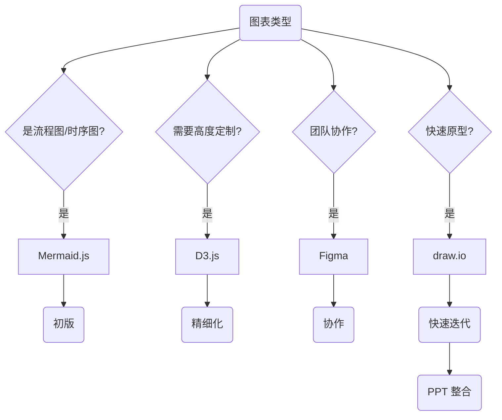

## 1. PaperBanana (arXiv:2601.23265, 2026)

### 1.1 核心价值

**PaperBanana** 是首个专门为 AI 科学家设计的自动化学术插图生成系统。

**论文**: [arXiv:2601.23265](https://arxiv.org/abs/2601.23265)

### 1.2 核心功能

| 功能 | 说明 |
|------|------|
| 自动插图需求识别 | 从论文文本自动识别需要可视化的部分 |
| 顶会风格生成 | 生成符合 NeurIPS/ICML/ICLR 审美的初版 |
| 智能图表推荐 | 根据内容推荐最适合的图表类型 |

---

## 2. 工具生态全景

```mermaid
flowchart TD
    subgraph ["原型阶段"]
        A[Mermaid.js] --> B(快速原型)
        C[draw.io] --> B
    end

    subgraph ["专业阶段"]
        B --> D[Figma]
        D --> E(专业插图)
    end

    subgraph ["自动化阶段"]
        F[PaperBanana] --> G(自动生成)
        G --> E
    end

    subgraph ["整合阶段"]
        E --> H(PPT 整合)
        H --> I(最终发布)
    end


```

---

## 3. 工具对比

| 工具 | 类型 | 优势 | 适用场景 | 学习曲线 |
|------|------|------|---------|---------|
| **Mermaid.js** | 文本驱动 | 代码驱动、版本友好 | 流程图、时序图 | 低 |
| **PlantUML** | UML | 标准化 | 系统架构图 | 中 |
| **D3.js** | 自定义 | 高度可定制 | 创新可视化 | 高 |
| **draw.io** | 在线绘图 | 免费、协作 | 快速原型 | 低 |
| **Figma** | 协作设计 | 专业级 | 高质量插图 | 中 |
| **PPT** | 整合工具 | 方便整合 | 最终发布 | 低 |

---

## 4. 工具选择决策树



---

## 5. GPT 辅助绘图流程

### 5.1 阶段 1: 需求分析

```
你是一位专业的学术插图设计师。请分析以下论文内容：

["粘贴论文的方法部分"]

输出：
1. 需要可视化的核心概念
2. 概念之间的关系
3. 适合的图表类型建议
```

### 5.2 阶段 2: 元素清单

```
基于以下论文内容, 生成架构图的元素清单：

["论文内容"]

请输出：
1. 所有模块及其功能描述
2. 模块间的数据流向
3. 需要标注的关键信息
4. 建议的颜色方案
```

### 5.3 阶段 3: 布局建议

```
请为以下内容设计布局方案：

["元素清单"]

考虑：
- 从左到右还是从上到下？
- 中心辐射还是层次结构？
- 留白和平衡
```

### 5.4 阶段 4: Mermaid 代码生成

```mermaid
flowchart LR
    subgraph ["输入处理"]
        A(原始数据) --> B(预处理)
    end

    subgraph ["核心模型"]
        B --> C(特征提取)
        C --> D(注意力模块)
        D --> E(输出生成)
    end

    subgraph ["损失函数"]
        F(主损失) --> G(多任务Loss)
        H(正则项) --> G
    end

    E --> I(最终输出)


```

---

## 6. 配色方案示例

### 6.1 AI 顶会风格

| 颜色 | 用途 | HEX |
|------|------|-----|
| 背景 | 图表背景 | #FFFFFF |
| 主模块 | 核心方法 | #10A37F |
| 辅助模块 | 对比方法 | #007AFF |
| 数据流 | 箭头连接 | #6B7280 |
| 高亮 | 关键部分 | #AB68FF |

### 6.2 暗色主题

| 颜色 | 用途 | HEX |
|------|------|-----|
| 背景 | 图表背景 | #212121 |
| 主模块 | 核心方法 | #10A37F |
| 辅助模块 | 对比方法 | #007AFF |
| 数据流 | 箭头连接 | #9CA3AF |
| 高亮 | 关键部分 | #AB68FF |

---

## 7. 最佳实践

<div class="card-grid">


整个论文使用统一的配色和字体方案


避免过多颜色, 每个颜色有明确含义


确保在黑白打印时也能清晰区分


每个图都有清晰的图例和说明


</div>

---

## 8. PaperBanana 论文要点补充（2601.23265）

为响应“把论文内容并入现有章节”的要求, 这里补充 PaperBanana 原文中的关键信息（不上传 PDF 文件）：

### 8.1 研究动机

论文明确指出：自动科研系统已能生成方法与实验, 但**发表级插图**仍是人工瓶颈。PaperBanana 的目标是把“论文图”从手工绘制转为可迭代自动流程。

### 8.2 方法框架

PaperBanana 采用 agentic pipeline, 将插图生成拆为可控阶段：

1. 检索参考图与风格约束
2. 规划图的语义内容与视觉结构
3. 图像渲染与矢量生成
4. 自我批评与迭代修正

### 8.3 评测设置

论文引入 **PaperBananaBench（292 个测试样例）**, 覆盖方法图等常见学术插图场景, 用于评估自动生成质量与可用性。

### 8.4 工程启发（对本书工作流）

- 图表要与方法叙事同源：由 method text 驱动, 而不是事后美化。
- 优先保证“信息正确 + 可复现”, 再追求视觉高级感。
- 生成后必须保留可编辑中间产物（SVG/分层素材）, 便于审稿期快速改图。

### 8.5 AutoFigure-edit 项目补充（根目录项目）

来自 `AutoFigure-Edit-main.zip` 的 README 还提供了一条很实用的“方法图工程化”路线：

- 从 method text 先生成草图 `figure.png`
- 用 SAM3 做区域检测与框选（产出 `samed.png` + `boxlib.json`）
- 对图元做去背景（RMBG-2.0）得到可复用 icon
- 生成占位模板 `template.svg` 并可迭代优化
- 最终组装成可编辑的 `final.svg`

这条链路和 PaperBanana 的共同点是：都强调中间产物可追溯, 便于审稿期快速改图。

---

## 9. Book 实战增补（逐篇并入）

> 本节并入 3 篇与"图表/视觉产物自动化"直接相关的文章，重点补齐从论文 Figure 到 PPT/视频转场的可执行流程。

### 9.1 1) PaperBanana：论文级 Figure 生成与润色

来源：`book/谷歌做了个论文专用版nano_banana_顶会级Figure直出.md`

#### 9.1.1 关键增量

- Figure 目标从“好看”升级为“语义正确 + 学术审美一致”。
- 支持两类核心产物：方法结构图（Methodology）与统计图（Statistical Plots）。
- 支持从草图/初版图自动润色：重排层级、统一配色、强化箭头逻辑。

#### 9.1.2 多 Agent 生产线（可复用）

1. 检索参考图与领域范式；
2. 规划结构化图描述（模块、关系、层级）；
3. 按审美约束生成初稿；
4. 评论代理迭代纠错（语义一致性检查）；
5. 输出论文可用版与可编辑资产。

#### 9.1.3 实操结论

- 统计图场景下，优先“AI 生成绘图代码再出图”，通常比直接生图更可控。
- 生成完成后必须保留中间素材，避免审稿期改图返工。

#### 9.1.4 详细步骤（PaperBanana 风格流程）

1. 准备输入：方法段落、关键模块列表、模块关系表（A→B）。
2. 先产出“结构草稿”而不是终稿，确认语义无误后再美化。
3. 进入风格增强阶段：统一配色、字体、间距、箭头方向。
4. 对照正文逐项核验：术语一致、关系一致、无缺漏模块。
5. 导出两份：投稿图 + 可编辑源文件（SVG/分层）。

#### 9.1.5 文章细节补充（质量核验表）

- 语义一致：图中术语与正文完全一致；
- 逻辑一致：箭头方向与流程关系无冲突；
- 审美一致：配色、字号、间距统一；
- 投稿可用：分辨率与版式满足会议模板要求。

### 9.2 2) PPT Skills：从静态页面到转场视频

来源：`book/学会了PPTSkills_豆包Kimi都感觉不香了_但90_的人卡在第一步_Gemini_NanoBananaPro_API国内用不了_这篇帮你全解决（8个坑_国内可用）.md`

#### 9.2.1 可执行流程

1. 输入主题与约束（页数、风格、分辨率）；
2. 批量生成每页视觉稿；
3. 两两页面分析视觉差异；
4. 自动生成转场提示词；
5. 调用视频模型生成过渡片段；
6. 用 `ffmpeg` 合成完整演示视频。

#### 9.2.2 工程化建议

- 优先“二次开发已有 skill”，避免从零造轮子。
- 配置分层：官方 API 与第三方 API 兼容两套路径。
- 对“连通性、鉴权、路径、依赖版本”做启动前自检，减少运行中断。

#### 9.2.3 详细步骤（PPT Skills 国内可用改造）

1. 复制原项目到新目录，避免直接污染上游版本。
2. 创建虚拟环境并安装依赖：

```bash
python3 -m venv venv
source venv/bin/activate
pip install google-genai pillow python-dotenv -i https://pypi.org/simple
```

3. 复制配置模板并填写：

```bash
cp .env.example .env
```

4. 先做 API 连接测试（返回 200 再继续主流程）。
5. 官方 SDK 不稳定时切 HTTP 直调，便于定位原始请求/响应。
6. 生成完成后再执行转场视频流水线，避免前置失败放大损失。

#### 9.2.4 文章细节补充（可复制命令顺序）

```bash
# 初始化
cd <project>
python3 -m venv venv
source venv/bin/activate
pip install -r requirements.txt

# 生成静态页
python generate_ppt.py --plan plans/demo.md --style styles/vector-illustration.md --resolution 2K

# 生成转场视频（按项目脚本）
python generate_transition.py --input outputs/<run>/images --output outputs/<run>/videos
ffmpeg -f concat -safe 0 -i outputs/<run>/videos/list.txt -c copy outputs/<run>/full_ppt_video.mp4
```

#### 9.2.5 常见问题排查（细化）

1. **API 连通失败**：先用独立脚本验证请求，再跑主流程。
2. **模型返回空结果**：检查模型名是否与供应商兼容。
3. **转场合成失败**：检查 ffmpeg 是否安装、输入列表是否存在。
4. **分辨率不一致**：统一生成参数，避免混用 2K/4K 导致拼接失败。

#### 9.2.6 高频坑位清单

- Base URL 误配（多拼路径导致 404）；
- 运行环境不一致（系统 Python 与虚拟环境混用）；
- 官方 SDK 报错不透明（必要时改 HTTP 直调便于排错）。

### 9.3 3) 图文一体化 Skill：文章生成 + 配图落地

来源：`book/Claude_Code_Skill_自动生成文章内容与配图.md`

#### 9.3.1 双 Skill 架构

- `article-generator`：负责文章结构、SEO 信息与图片占位符。
- `image-generator`：负责读取占位符上下文、生成 prompt、调用图像流水线。

#### 9.3.2 8 步流水线（建议模板）

1. 生成文章与占位图；
2. 提取占位符上下文；
3. 生成每图 prompt；
4. 批量生图；
5. 转 `webp` 压缩；
6. 上传对象存储（如 R2）；
7. 回填 CDN 链接；
8. 输出可发布版本。

#### 9.3.3 关键命令示例

```bash
npm run generate-images <article-slug>
npm run compress-images <article-slug>
npm run upload-images <article-slug>
npm run replace-images <article-slug>
```

#### 9.3.4 详细步骤（图文流水线）

1. 用 `article-generator` 产出文章与占位图。
2. 运行 `image-generator` 读取占位并生成 prompt。
3. 依次执行四个命令：生图 → 压缩 → 上传 → 链接替换。
4. 每一步检查输出目录是否存在且非空。
5. 替换完成后抽查 3 处图片链接，确认 CDN 可访问。

#### 9.3.5 文章细节补充（目录规范建议）

```text
articles/<slug>.md
prompts/<slug>/*.md
images/<slug>/*.png
images/<slug>/*.webp
```

建议每一步都写入一个 `status.json`，用于中断后恢复：

- `step`
- `ok`
- `updated_at`
- `error`

#### 9.3.6 章节衔接说明

这套方案与本章已有的 `PaperBanana + AutoFigure-edit` 形成互补：

- 论文 Figure 偏“科研表达规范化”；
- 图文流水线偏“内容生产自动化”；
- 两者都强调中间产物与可追溯性。
