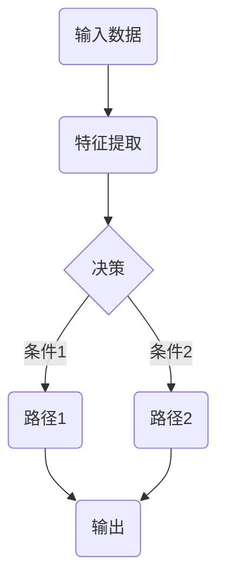

## 1. 论文图表类型清单

从几千篇论文里提取"表达强"的图，按类型建一个参考库：

### 1.1 方法结构图 (Architecture)

- 整体系统架构
- 模块关系
- 数据流向

### 1.2 流程图 (Pipeline)

- 训练流程
- 推理流程
- 数据处理流程

### 1.3 训练/推理示意图

- 算法步骤可视化
- 时序关系

### 1.4 主结果表 + 消融图

- 对比实验表格
- 消融研究图表

### 1.5 失败案例可视化

- 边界情况
- 错误分析

---

## 2. 工具详细对比

### 2.1 Mermaid.js

**优点**:
- 纯文本语法，易于版本控制
- 支持多种图表类型
- GitHub/GitLab 原生支持

**缺点**:
- 定制能力有限
- 复杂图表难以实现

**代码示例**:

---

### 2.2 PlantUML

**优点**:
- UML 标准化
- 支持时序图、用例图等
- 文本驱动，易于维护

**缺点**:
- 学习曲线较陡
- 主要针对 UML 场景

---

### 2.3 D3.js

**优点**:
- 高度可定制
- 支持复杂交互
- 强大的数据绑定能力

**缺点**:
- 学习成本高
- 开发时间长

**适用场景**: 创新性的数据可视化，需要展示论文的独特洞见

---

### 2.4 draw.io

**优点**:
- 完全免费
- 支持 Git 集成
- 丰富的图形库

**缺点**:
- 大型项目性能下降
- 协作功能不如 Figma

---

### 2.5 Figma

**优点**:
- 专业级设计工具
- 实时协作
- 强大的组件系统

**缺点**:
- 需要学习成本
- 免费版有功能限制

**适用场景**: 高质量插图，特别是需要多人协作时

---

## 3. 推荐工作流

### 3.1 阶段1: 快速原型

使用 **draw.io** 或 **Mermaid.js** 快速搭建图表框架

### 3.2 阶段2: 精细化

对于关键图表，使用 **Figma** 进行精细化设计

### 3.3 阶段3: 代码生成

对于数据可视化，使用 **D3.js** 或 **Python (matplotlib/plotly)**

### 3.4 阶段4: 整合

使用 **PPT** 或 **Figma** 进行最终整合
