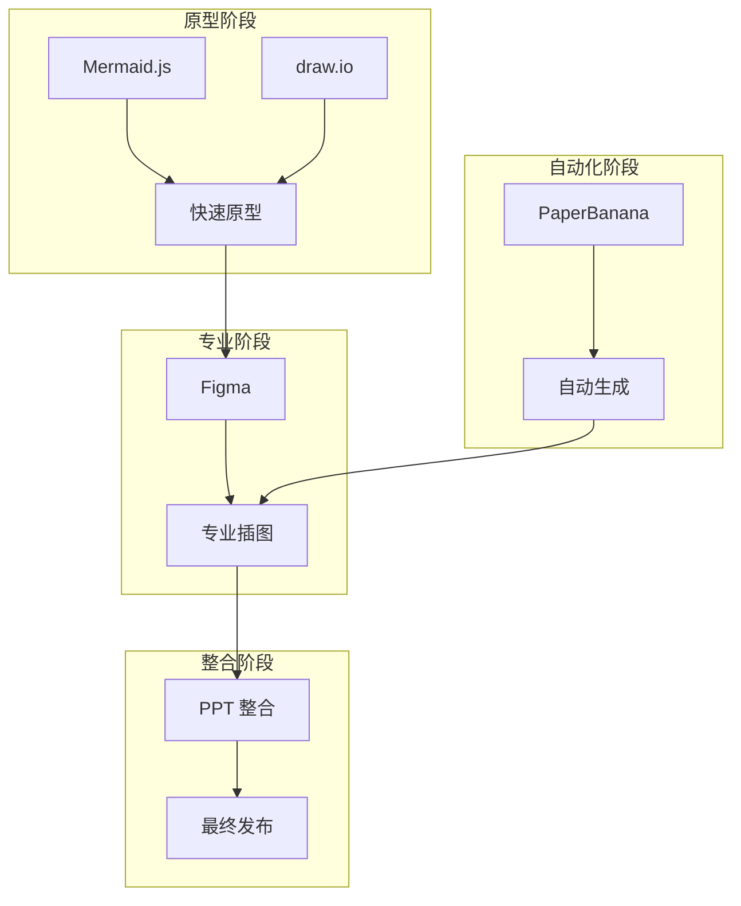
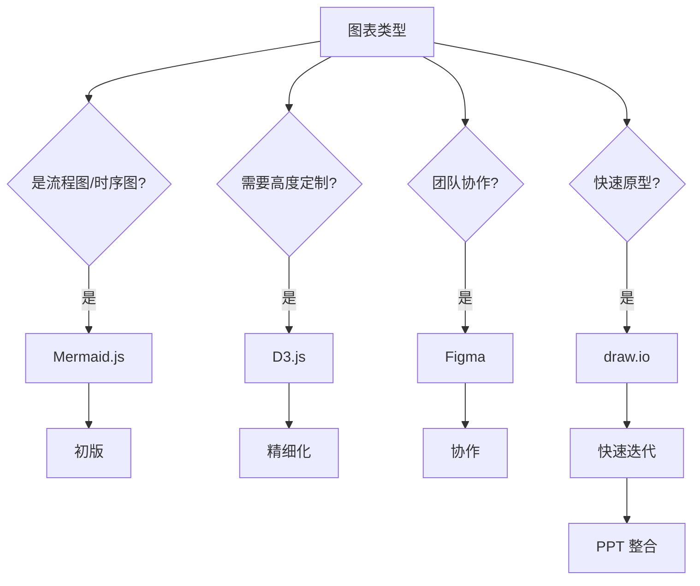
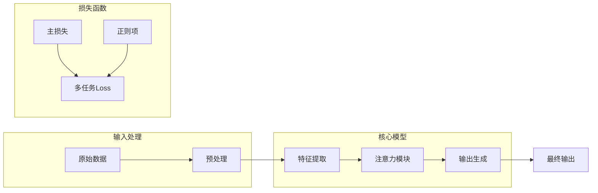

## PaperBanana (arXiv:2601.23265, 2026)

### 核心价值

**PaperBanana** 是首个专门为 AI 科学家设计的自动化学术插图生成系统。

**论文**: [arXiv:2601.23265](https://arxiv.org/abs/2601.23265)

### 核心功能

| 功能 | 说明 |
|------|------|
| 自动插图需求识别 | 从论文文本自动识别需要可视化的部分 |
| 顶会风格生成 | 生成符合 NeurIPS/ICML/ICLR 审美的初版 |
| 智能图表推荐 | 根据内容推荐最适合的图表类型 |

---

## 工具生态全景



---

## 工具对比

| 工具 | 类型 | 优势 | 适用场景 | 学习曲线 |
|------|------|------|---------|---------|
| **Mermaid.js** | 文本驱动 | 代码驱动、版本友好 | 流程图、时序图 | 低 |
| **PlantUML** | UML | 标准化 | 系统架构图 | 中 |
| **D3.js** | 自定义 | 高度可定制 | 创新可视化 | 高 |
| **draw.io** | 在线绘图 | 免费、协作 | 快速原型 | 低 |
| **Figma** | 协作设计 | 专业级 | 高质量插图 | 中 |
| **PPT** | 整合工具 | 方便整合 | 最终发布 | 低 |

---

## 工具选择决策树



---

## GPT 辅助绘图流程

### 阶段 1: 需求分析

```
你是一位专业的学术插图设计师。请分析以下论文内容：

[粘贴论文的方法部分]

输出：
1. 需要可视化的核心概念
2. 概念之间的关系
3. 适合的图表类型建议
```

### 阶段 2: 元素清单

```
基于以下论文内容，生成架构图的元素清单：

[论文内容]

请输出：
1. 所有模块及其功能描述
2. 模块间的数据流向
3. 需要标注的关键信息
4. 建议的颜色方案
```

### 阶段 3: 布局建议

```
请为以下内容设计布局方案：

[元素清单]

考虑：
- 从左到右还是从上到下？
- 中心辐射还是层次结构？
- 留白和平衡
```

### 阶段 4: Mermaid 代码生成



---

## 配色方案示例

### AI 顶会风格

| 颜色 | 用途 | HEX |
|------|------|-----|
| 背景 | 图表背景 | #FFFFFF |
| 主模块 | 核心方法 | #10A37F |
| 辅助模块 | 对比方法 | #007AFF |
| 数据流 | 箭头连接 | #6B7280 |
| 高亮 | 关键部分 | #AB68FF |

### 暗色主题

| 颜色 | 用途 | HEX |
|------|------|-----|
| 背景 | 图表背景 | #212121 |
| 主模块 | 核心方法 | #10A37F |
| 辅助模块 | 对比方法 | #007AFF |
| 数据流 | 箭头连接 | #9CA3AF |
| 高亮 | 关键部分 | #AB68FF |

---

## 最佳实践

<div class="card-grid">


整个论文使用统一的配色和字体方案


避免过多颜色，每个颜色有明确含义


确保在黑白打印时也能清晰区分


每个图都有清晰的图例和说明


</div>

---

## PaperBanana 论文要点补充（2601.23265）

为响应“把论文内容并入现有章节”的要求，这里补充 PaperBanana 原文中的关键信息（不上传 PDF 文件）：

### 研究动机

论文明确指出：自动科研系统已能生成方法与实验，但**发表级插图**仍是人工瓶颈。PaperBanana 的目标是把“论文图”从手工绘制转为可迭代自动流程。

### 方法框架

PaperBanana 采用 agentic pipeline，将插图生成拆为可控阶段：

1. 检索参考图与风格约束
2. 规划图的语义内容与视觉结构
3. 图像渲染与矢量生成
4. 自我批评与迭代修正

### 评测设置

论文引入 **PaperBananaBench（292 个测试样例）**，覆盖方法图等常见学术插图场景，用于评估自动生成质量与可用性。

### 工程启发（对本书工作流）

- 图表要与方法叙事同源：由 method text 驱动，而不是事后美化。
- 优先保证“信息正确 + 可复现”，再追求视觉高级感。
- 生成后必须保留可编辑中间产物（SVG/分层素材），便于审稿期快速改图。

### AutoFigure-edit 项目补充（根目录项目）

来自 `AutoFigure-Edit-main.zip` 的 README 还提供了一条很实用的“方法图工程化”路线：

- 从 method text 先生成草图 `figure.png`
- 用 SAM3 做区域检测与框选（产出 `samed.png` + `boxlib.json`）
- 对图元做去背景（RMBG-2.0）得到可复用 icon
- 生成占位模板 `template.svg` 并可迭代优化
- 最终组装成可编辑的 `final.svg`

这条链路和 PaperBanana 的共同点是：都强调中间产物可追溯，便于审稿期快速改图。
