## PaperBanana (arXiv:2601.23265, 2026)

### 核心价值

**PaperBanana** 是首个专门为 AI 科学家设计的自动化学术插图生成系统。

**论文**: [arXiv:2601.23265](https://arxiv.org/abs/2601.23265)

### 核心功能

| 功能 | 说明 |
|------|------|
| 自动插图需求识别 | 从论文文本自动识别需要可视化的部分 |
| 顶会风格生成 | 生成符合 NeurIPS/ICML/ICLR 审美的初版 |
| 智能图表推荐 | 根据内容推荐最适合的图表类型 |

---

## 工具生态全景

```mermaid
flowchart TD
    subgraph 原型阶段
        A[Mermaid.js] --> B[快速原型]
        C[draw.io] --> B
    end

    subgraph 专业阶段
        B --> D[Figma]
        D --> E[专业插图]
    end

    subgraph 自动化阶段
        F[PaperBanana] --> G[自动生成]
        G --> E
    end

    subgraph 整合阶段
        E --> H[PPT 整合]
        H --> I[最终发布]
    end

    style F fill:#2a1a3a,stroke:#ab68ff
    style D fill:#1a2a3a,stroke:#007aff
```



---

## 工具对比

| 工具 | 类型 | 优势 | 适用场景 | 学习曲线 |
|------|------|------|---------|---------|
| **Mermaid.js** | 文本驱动 | 代码驱动、版本友好 | 流程图、时序图 | 低 |
| **PlantUML** | UML | 标准化 | 系统架构图 | 中 |
| **D3.js** | 自定义 | 高度可定制 | 创新可视化 | 高 |
| **draw.io** | 在线绘图 | 免费、协作 | 快速原型 | 低 |
| **Figma** | 协作设计 | 专业级 | 高质量插图 | 中 |
| **PPT** | 整合工具 | 方便整合 | 最终发布 | 低 |

---

## 工具选择决策树

```mermaid
flowchart TD
    A[图表类型] --> B{是流程图/时序图?}
    A --> C{需要高度定制?}
    A --> D{团队协作?}
    A --> E{快速原型?}

    B -->|是| F[Mermaid.js]
    C -->|是| G[D3.js]
    D -->|是| H[Figma]
    E -->|是| I[draw.io]
    F --> J[初版]
    G --> K[精细化]
    H --> L[协作]
    I --> M[快速迭代]

    M --> N[PPT 整合]

    style F fill:#1a3a1a,stroke:#10a37f
    style G fill:#2a1a3a,stroke:#ab68ff
    style H fill:#1a2a3a,stroke:#007aff
```



---

## GPT 辅助绘图流程

### 阶段 1: 需求分析

```
你是一位专业的学术插图设计师。请分析以下论文内容：

[粘贴论文的方法部分]

输出：
1. 需要可视化的核心概念
2. 概念之间的关系
3. 适合的图表类型建议
```

### 阶段 2: 元素清单

```
基于以下论文内容，生成架构图的元素清单：

[论文内容]

请输出：
1. 所有模块及其功能描述
2. 模块间的数据流向
3. 需要标注的关键信息
4. 建议的颜色方案
```

### 阶段 3: 布局建议

```
请为以下内容设计布局方案：

[元素清单]

考虑：
- 从左到右还是从上到下？
- 中心辐射还是层次结构？
- 留白和平衡
```

### 阶段 4: Mermaid 代码生成

```mermaid
flowchart LR
    subgraph 输入处理
        A[原始数据] --> B[预处理]
    end

    subgraph 核心模型
        B --> C[特征提取]
        C --> D[注意力模块]
        D --> E[输出生成]
    end

    subgraph 损失函数
        F[主损失] --> G[多任务Loss]
        H[正则项] --> G
    end

    E --> I[最终输出]

    style A fill:#1a3a1a,stroke:#10a37f
    style D fill:#2a1a3a,stroke:#ab68ff
    style G fill:#1a2a3a,stroke:#007aff
```



---

## 配色方案示例

### AI 顶会风格

| 颜色 | 用途 | HEX |
|------|------|-----|
| 背景 | 图表背景 | #FFFFFF |
| 主模块 | 核心方法 | #10A37F |
| 辅助模块 | 对比方法 | #007AFF |
| 数据流 | 箭头连接 | #6B7280 |
| 高亮 | 关键部分 | #AB68FF |

### 暗色主题

| 颜色 | 用途 | HEX |
|------|------|-----|
| 背景 | 图表背景 | #212121 |
| 主模块 | 核心方法 | #10A37F |
| 辅助模块 | 对比方法 | #007AFF |
| 数据流 | 箭头连接 | #9CA3AF |
| 高亮 | 关键部分 | #AB68FF |

---

## 最佳实践

<div class="card-grid">


整个论文使用统一的配色和字体方案


避免过多颜色，每个颜色有明确含义


确保在黑白打印时也能清晰区分


每个图都有清晰的图例和说明


</div>
