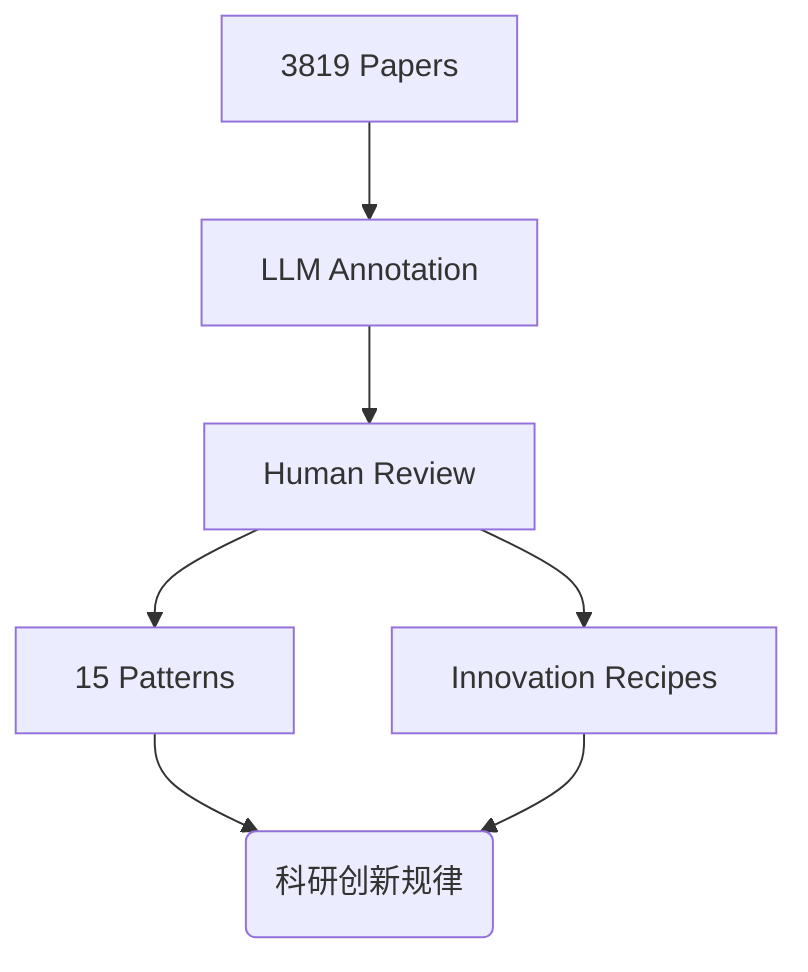
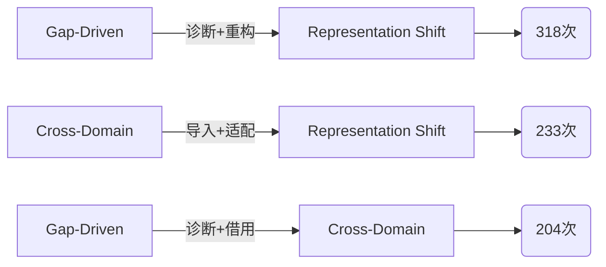

import { Card, CardGrid } from '../../../components/mdx/starlight-shim';

## 1. Sci-Reasoning 数据集

### 1.1 核心价值

**Sci-Reasoning** 通过 LLM+Human Review的方法, 对 2023–2025 年 NeurIPS、ICML、ICLR 的 **3819 篇 Oral/Spotlight 论文**进行"学术谱系"建模。

**资源链接**:
- 代码: [Sci-Reasoning GitHub](https://github.com/AmberLJC/Sci-Reasoning)
- 数据集: [HuggingFace Dataset](https://huggingface.co/datasets/AmberLJC/Sci-Reasoning)

---

## 2. 15 种科研思维模式详解

**诊断+重构**：识别当前方法的局限性, 将限制转化为设计约束。

**跨域融合**：从相邻领域引入解决方案, 激活创新可能。

**表示转化**：替换问题的基本表示单元, 开辟新视角。

### 2.1 完整模式列表

| 编号 | 模式 | 比例 | 核心价值 |
|------|------|------|---------|
| P01 | Gap-Driven Reframing | 24.2% | 转化限制为设计约束 |
| P02 | Cross-Domain Synthesis | 18.0% | 跨领域融合 |
| P03 | Representation Shift | 10.5% | 表示转化 |
| P04 | Modular Pipeline Composition | 4.2% | 模块化组合 |
| P05 | Data & Evaluation Engineering | 5.4% | 数据与评测工程 |
| P06 | Principled Probabilistic Modeling | 5.4% | 概率建模 |
| P07 | Formal-Experimental Tightening | 6.7% | 理论实验紧密结合 |
| P08 | Approximation Engineering | 4.9% | 可扩展性近似 |
| P09 | Inference-Time Control | 2.4% | 推理时控制 |
| P10 | Structural Inductive Bias | 5.1% | 结构归纳偏置 |
| P11 | Multiscale Modeling | 1.4% | 多尺度建模 |
| P12 | Mechanistic Decomposition | 1.9% | 机制分解 |
| P13 | Adversary Modeling | 1.5% | 对手建模 |
| P14 | Numerics & Systems Co-design | 1.4% | 数值与系统协同 |
| P15 | Data-Centric Optimization | 2.1% | 以数据为中心 |

---

## 3. Innovation Recipes（Innovation Recipes）

### 3.1 高价值组合

| 组合模式 | 出现次数 | 策略 |
|---------|---------|------|
| Gap-Driven + Representation Shift | 318 | "诊断+重构" |
| Cross-Domain + Representation Shift | 233 | "导入+适配" |
| Gap-Driven + Cross-Domain | 204 | "诊断+借用" |

---

## 4. 会议偏好分析

| 会议 | 偏好模式 | 写作建议 |
|------|---------|---------|
| **ICML** | 形式化方法 (8.3%), 概率建模 (7.5%) | 增加理论分析和证明 |
| **ICLR** | 表示创新 (11.8%), 基准测试 (8.5%) | 侧重表示分析和可视化 |
| **NeurIPS** | 平衡跨学科覆盖 | 强调方法的生物学合理性 |

---

## 5. LLM 评估基准 (Hit@10)

这个评估衡量：给定前人工作, LLM 能否预测出研究方向的准确度。

| 模型 | Hit@10 得分 |
|------|-------------|
| **Gemini 2.5 Pro** | 49.35% |
| Claude Opus 4 | 42.86% |
| GPT-5.2 | 38.89% |
| Claude Sonnet 4 | 29.87% |

---

## 6. AI Scientist 系列

### 6.1 完整对比

| 项目 | 时间 | 核心特点 | 代码 |
|------|------|---------|------|
| **The AI Scientist** | 2024.08 | 完整研究自动化 | [SakanaAI](https://github.com/SakanaAI/AI-Scientist) |
| **The AI Scientist-v2** | 2025 | 无代码模板自动化 | - |
| **ChemCrow** | 2024 | 化学研究 Agent (728+ 引用) | - |
| **Virtual-Scientists** | ACL 2025 | 端到端科研协作 | [InternScience](https://github.com/InternScience/Virtual-Scientists) |
| **Kosmos** | 2025 | 自主数据驱动发现 | - |
| **AI-Researcher** | 2025 | 完全自主研究系统 | - |

---

## 7. 实践建议

### 7.1 如何借鉴 Sci-Reasoning

1. **构建调研库时做标签化**
   - 每篇论文标注其"创新类型"
   - 便于后续 pattern mining

2. **关注Innovation Recipes**
   - 高频组合往往意味着"成熟赛道"
   - 低频组合可能有更大的创新空间

3. **结合会议偏好**
   - ICML 侧重理论
   - ICLR 侧重表示
   - NeurIPS 平衡跨学科

**核心启示**：创新不是玄学, 是可以被系统化分析和复制的模式。

---

## 8. 根目录论文内容整合（不上传 PDF 本体）

### 8.1 论文一：Towards Execution-Grounded Automated AI Research (2601.14525)

根据原文摘要与项目环境说明, 这项工作提出了一个 **execution-grounded** 的自动科研框架, 核心不是只生成“看起来合理”的 idea, 而是把 idea 真实落地执行并用反馈反哺下一轮搜索。

**关键点：**
- 构建自动执行器：自动打补丁、提交代码、分配 GPU、回收训练日志。
- 设定两个可执行研究环境：
  - post-training：GRPO + MATH（Qwen2.5-Math-1.5B）
  - pre-training：nanoGPT + FineWeb
- 研究目标从“语言 plausibility”转为“执行后有效性”。
- 强调 execution feedback 对后续 idea 迭代的价值。

### 8.2 论文二：Idea2Story (2601.20833)

该工作把"research idea → 可写论文叙事"的过程做成了结构化流水线, 核心贡献是 **pre-computation-driven** 思路：尽量把文献理解和结构化表征前置, 降低在线大上下文推理成本与幻觉风险。

**关键点：**
- 用知识图谱组织 Idea / Pattern / Domain / Paper 节点。
- 通过模式选择、故事生成、反思修正, 产出完整 scientific narrative skeleton。
- 引入 anchored multi-agent review, 使打分更可审计、更可复现。
- 输出可直接进入写作阶段的结构化结果（title/abstract/problem/method/contrib/experiments）。

### 8.3 并入现有工作流的建议

1. 在 `1.1 调研` 阶段优先落地“可执行环境”, 避免只停留在概念验证。
2. 在 `1.2 项目` 阶段增加“叙事骨架检查”, 确保 idea 到论文表达不断层。
3. 让“执行反馈”与“叙事反馈”双闭环并行：一个校验有效性, 一个校验可写性。
