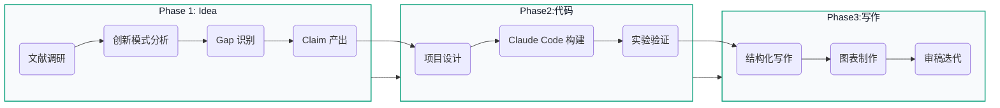

## 研究工作流概览

## 快速价值

<ul class="index-highlights">
  <li>🚀 用 14 周路线，把科研任务拆成可执行流水线。</li>
  <li>🧠 用多模型交叉审查，减少方向性失误和实验返工。</li>
  <li>🧪 用结构化实验与审稿闭环，提升投稿成功率。</li>
  <li>📊 用流程图与模板化文档，让团队协作更稳定。</li>
</ul>

## 核心功能

### Idea 生成
系统化的文献调研方法，使用多模型交叉验证，从2000+论文中发现可写的研究空白。

**核心方法：**
- Related Work Map 构建
- Assumption Matrix 分析
- Gap List 产出
- Claim Candidate Pool

### 代码实现
Claude Code、GPT-5.2系列、多Agent框架的最佳实践，高效构建实验系统。

**核心能力：**
- 并行协作架构
- CLAUDE.md 团队记忆
- Sub-agents 交叉验证
- 自动化验证闭环

### 论文图表
自动化绘图工具推荐，专业图表设计规范，让论文插图更具说服力。

**工具生态：**
- PaperBanana 自动生成
- Mermaid 流程图
- D3.js 自定义可视化
- Figma 专业设计

### 论文写作
论证链构建方法，多模型协作写作，Prism等新一代写作工具使用指南。

**写作方法：**
- Claim → Evidence 论证链
- 多模型协作 tmux 配置
- 会议特定写作模板

### 审稿迭代
结构化审稿流水线，会议特定审稿模板，Rebuttal写作策略。

**审稿流水线：**
- 10+ 轮自动审稿
- TODO 驱动修改
- 分类回应策略

### 工具生态
Elicit、Zotero-MCP、Sci-Reasoning等最新工具，构建完整科研工具链。

---

## 14 周完整时间线

| 周次 | 阶段 | 核心任务 | 输出 |
|------|------|---------|------|
| Week 1-2 | 调研 | Elicit 扫描 + Sci-Reasoning 分析 | Gap 清单 |
| Week 3 | 设计 | Claude Code 生成文档 | 项目设计 |
| Week 4-7 | 实现 | Sub-agents 并行开发 | 代码 + 实验 |
| Week 8-9 | 写作 | Prism + 图表生成 | 初稿 |
| Week 10 | 审稿 | 10+ 轮自动审稿 | 修改版 |
| Week 11 | 投稿 | 格式检查 | 最终版 |
| Week 12+ | Rebuttal | 如有需要 | 录用 |

---

## 适用场景

- **研究生/博士生**: 系统学习 AI 研究方法，提升论文产出质量
- **工业界研究员**: 快速掌握最新工具，提高研发效率
- **独立研究者**: 建立完整的科研工作流，从零开始发表顶会论文

## 从这里开始

- 新手建议先读：[`idea/research`](idea/research) → [`idea/projects`](idea/projects)
- 需要快速落地：[`tools/workflow`](tools/workflow) + [`review/structured`](review/structured)
- 关注工程效率：[`code/claude`](code/claude) + [`code/agents`](code/agents)

---

<strong>本书持续更新中</strong> · 视觉系统升级：2026-02-09 · 默认主题：浅色

