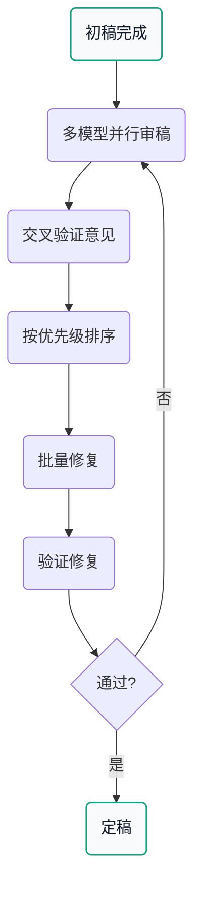
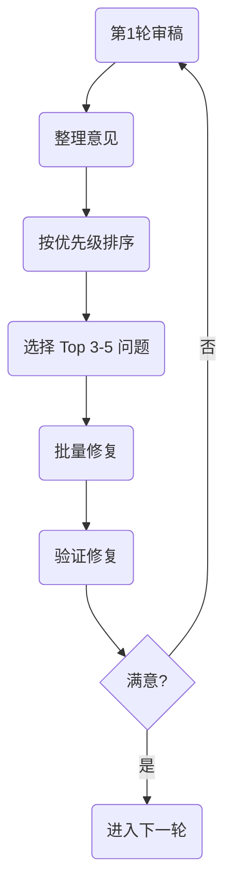

## 1. 审稿流水线概览



---

## 2. 审稿输出要结构化

审稿必须回答以下关键问题：

| 问题 | 重要性 |
|------|-------|
| 哪条 claim 缺证据？ | 🔴 高 |
| 哪个实验最关键但没做？ | 🔴 高 |
| 哪个 baseline 必须补？ | 🔴 高 |
| 哪段叙事最像空话？ | 🟡 中 |
| 哪个地方最容易被说不新？ | 🔴 高 |

---

## 3. 审稿输出模板

```markdown
# 审稿意见

## 1. 缺证据的 Claim

| Claim | 问题 | 需要补充 |
|-------|------|---------|
| XXX机制是关键创新 | 没有消融实验 | 去掉XXX后的性能对比 |
| 显著优于SOTA | 评价指标不公平 | 统一指标后重新对比 |

## 2. 缺失的实验

| 实验类型 | 现状 | 需要补充 |
|---------|------|---------|
| 压力测试 | 无 | 低资源/噪声/分布外测试 |
| 消融实验 | 不完整 | 每个模块的独立贡献 |

## 3. 缺失的 Baseline

| 方法 | 年份 | 问题 | 需要 |
|------|------|------|------|
| YYY方法 | 2024 | 最新强baseline | 补充对比 |

## 4. 空话段落

| 位置 | 问题 | 建议 |
|------|------|------|
| 3.2节第二段 | 显著提升无数据 | 补充具体数字或删除 |

## 5. 创新性质疑预案

| 可能的质疑 | 应对策略 |
|-----------|---------|
| 只是简单组合 | 强调发现的XXX insight |
| 不公平对比 | 补充公平对比实验 |
```

---

## 4. TODO 转化模板

每条意见对应一个改动 + 验收标准：

```markdown
# TODO List

## 紧急（提交前必须完成）

- [ ] 补消融实验
  - 内容: 去掉模块 X
  - 验收: 指标下降 ≥ 5%

- [ ] 补公平对比
  - 内容: 训练步数对齐 + 算力对齐
  - 验收: 与 YYY 方法公平对比

- [ ] 补压力测试
  - 内容: 低资源/噪声/分布外测试
  - 验收: 每个场景至少 1 组实验

## 重要（提升质量）

- [ ] 重写3.2节
  - 内容: 添加具体数据或删除空洞表述
  - 验收: 每段有具体数字支撑

- [ ] 增加与ZZZ的对比讨论
  - 内容: 强调我们的 XXX insight
  - 验收: 明确说明区别和优势

## 可选（锦上添花）

- [ ] 补充人类评估实验
- [ ] 增加可视化分析
```

---

## 5. 多模型审稿配置

### 5.1 模型分工

| 模型 | 侧重点 | Prompt 重点 |
|------|-------|-----------|
| Claude Opus 4.6 | 整体逻辑 | 叙事连贯性、创新性 |
| GPT-5.2 Pro | 技术细节 | 方法正确性、实验设计 |
| Gemini Pro | 可复现性 | 代码完整性、数据可用性 |

### 5.2 审稿 Prompt

```python

你是一位 ["会议"] 的资深审稿人。请严格审查以下论文：

["粘贴论文内容"]

请从以下角度审查：

1. **创新性 (Novelty)**
   - 主要贡献是什么？
   - 与之前工作有何不同？

2. **技术正确性 (Technical Soundness)**
   - 方法是否正确？
   - 理论是否成立？

3. **实验完整性 (Experiments)**
   - Baseline 是否足够？
   - 消融实验是否完整？

4. **写作质量 (Writing)**
   - 逻辑是否清晰？
   - 表述是否准确？

请用以下格式输出：

---
## Overall Score: (1-5)

## Strengths:
- ...

## Weaknesses:
1. ["严重"] ...
2. ["中等"] ...
3. ["轻微"] ...

## Detailed Comments:
...
---

```

---

## 6. 迭代循环

### 6.1 10+ 轮迭代流程



### 6.2 迭代原则

1. **不要贪多**：每轮只修复 3-5 条
2. **优先级排序**：先解决最致命的
3. **验证修复**：修复后重新审稿确认
4. **记录进度**：保留修改历史

### 6.3 审稿闭环增强（补充）

来自 `AI research.md` 与 `vibe` 并集经验的补充做法：

- 每轮审稿输出后先做 **Issue 聚类**（证据不足 / 实验缺口 / 叙事问题 / 格式问题）
- 每类只挑 Top 1-2 个高影响问题进入当轮修复，避免“全面开花但都不深”
- 对每个修复项明确“验证证据”字段（新增实验、修改段落、补引用）
- 保留一份 **审稿→修复映射表**，方便 Rebuttal 时直接引用

---

## 7. 常见问题与应对

| 问题 | 应对策略 |
|------|---------|
| 审稿意见冲突 | 以技术细节为准 |
| 无法复现的实验 | 补充复现步骤 |
| 创新性被质疑 | 增加对比实验 |
| 实验设计被质疑 | 解释设计理由 |
| 写作被吐槽 | 精修语言表达 |

---

## 8. 审稿检查清单

### 8.1 提交前检查

- [ ] 所有 claim 都有实验支撑
- [ ] 强 baseline 都已对比
- [ ] 消融实验完整
- [ ] 压力测试覆盖边界情况
- [ ] 引用格式正确
- [ ] 语言表达清晰
- [ ] 图表清晰可读
- [ ] 补充材料完整
