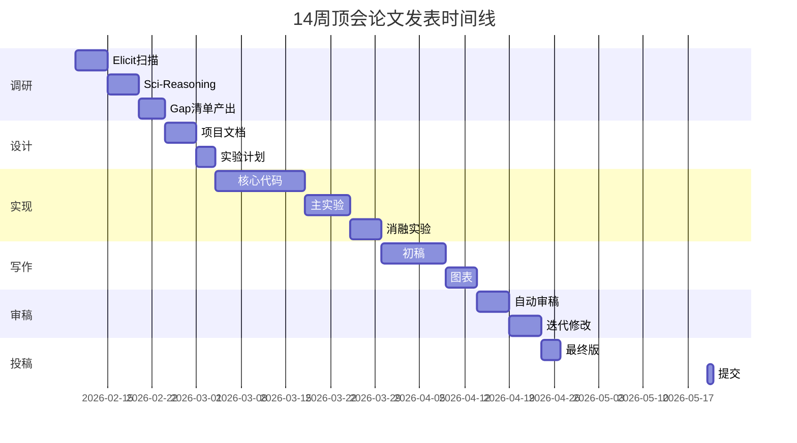
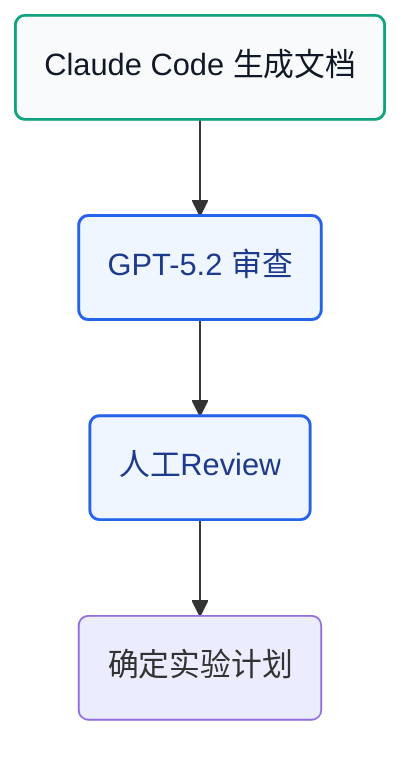
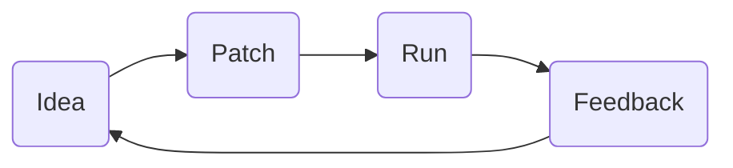

import { Card, CardGrid } from '../../../components/mdx/starlight-shim';

## 1. 完整研究时间线



---

## 2. Week 1-2: 调研阶段

### 2.1 目标
产出结构化的研究地图和空白清单

### 2.2 详细工作流


### 2.3 具体任务

1. **使用 Elicit** 扫描领域关键词（1-2天）
2. **使用 Semantic Scholar** 探索研究脉络（1-2天）
3. **使用 Sci-Reasoning** 分析创新模式（2-3天）
4. **整理研究地图**（2-3天）：
   - 问题子类分类
   - 方法范式分类
   - 评测基准整理

### 2.4 产出

| 产出物 | 说明 |
|-------|------|
| Research Gap 清单 | 10-20个候选方向 |
| Benchmark & Metric Sheet | 主流数据集和指标 |
| Assumption Matrix | 隐含假设分析 |

---

## 3. Week 3: 项目设计

### 3.1 目标
确定研究问题和实验计划

### 3.2 详细工作流



### 3.3 具体任务

1. **生成项目文档**（使用 Claude Code, 2-3天）
2. **审查文档**（使用 GPT-5.2 Pro, 1天）：
   - claim-实验是否对齐？
   - baseline 是否足够强？
   - 是否有致命假设？
3. **确定实验计划**（1天）：
   - 主实验设计
   - 消融实验清单
   - 压力测试场景

### 3.4 产出

| 产出物 | 说明 |
|-------|------|
| 项目文档 | 20-30页详细文档 |
| 实验计划 | 主实验+消融+压力测试 |
| 里程碑时间表 | 每周任务分解 |

---

## 4. Week 4-7: 代码实现 + 实验

### 4.1 目标
完成实现和主要实验

### 4.2 团队配置

```mermaid
flowchart TD
    subgraph ["开发团队"]
        A[Architect x1] --> E(核心模块)
        B[Implementer x2] --> E
        C[Tester x1] --> F(测试评测)
    end

    subgraph ["质量保障"]
        F --> G(自动汇总)
    end

    classDef role fill:#ecfeff,stroke:#0ea5e9,stroke-width:1.5px,color:#0f172a
    class A,B,C role


```

### 4.3 具体任务

1. **并行开发**（Claude Code, 2-3周）
2. **实验执行**（1周）：
   - 主实验：与 baseline 对比
   - 消融实验：每个模块贡献
   - 压力测试：边界条件
3. **结果汇总**（2-3天）

### 4.4 产出

| 产出物 | 说明 |
|-------|------|
| 可复现代码库 | 完整的实验代码 |
| 实验结果 | 主表+消融+分析 |
| 复现指南 | 便于他人复现 |

---

## 5. Week 8-9: 论文写作

### 5.1 目标
完成论文初稿

### 5.2 写作流程


### 5.3 具体任务

1. **生成大纲**（Claude Opus 4.6, 1天）
2. **并行写作**（多实例, 5-7天）
3. **图表制作**（2-3天）

### 5.4 产出

| 产出物 | 说明 |
|-------|------|
| 论文初稿 | 8-10页正文 |
| 所有图表 | 方法图、结果图 |
| 补充材料 | 额外实验、细节 |

---

## 6. Week 10: 审稿迭代

### 6.1 目标
通过多轮审稿迭代提升论文质量

### 6.2 审稿配置

| 轮次 | 模型 | 侧重点 |
|------|------|-------|
| 第1轮 | Claude Opus 4.6 | 整体逻辑 |
| 第2轮 | GPT-5.2 Pro | 技术细节 |
| 第3轮 | Gemini Pro | 可复现性 |

### 6.3 具体任务

1. **多模型并行审稿**（2天）
2. **交叉验证意见**（1天）
3. **批量修改**（2天）

### 6.4 产出

| 产出物 | 说明 |
|-------|------|
| 稳定投稿版本 | 准备提交 |
| 审稿意见记录 | 历史迭代 |
| 修改说明 | 响应记录 |

---

## 7. Week 11: 投稿

### 检查清单

- [ ] 格式符合会议要求
- [ ] 页数在限制内
- [ ] 补充材料完整
- [ ] 作者信息正确
- [ ] 代码/数据链接有效

---

## 8. Week 12+: Rebuttal

### Rebuttal 策略

| 意见类型 | 应对策略 |
|---------|---------|
| 可修复的 | 承诺修改, 补充说明 |
| 误解的 | 礼貌澄清, 补充证据 |
| 不同意但合理 | 讨论, 引用支持文献 |
| 不同意的 | 坚定反驳, 有理有据 |

---

## 9. 时间线总览

```
Week 1-2:  ██████████████  调研
Week 3:    ██████          项目设计
Week 4-7: █████████████████████████  代码+实验
Week 8-9: ██████████████  写作
Week 10:  ██████████████  审稿迭代
Week 11:  ████            投稿
Week 12+: ██████████████  Rebuttal（如需要）
```

### 执行闭环强化（补充）

在 Week 4-10 阶段建议显式加入 execution-grounded 子循环：



- **Idea**：提出可验证改动（必须绑定指标）
- **Patch**：最小可执行改动（便于回滚）
- **Run**：在固定环境里跑通训练/评测
- **Feedback**：记录收益/失败模式并更新下一轮计划

这样做可以把“灵感驱动”转换为“证据驱动”，减少无效迭代。

---

## 10. 每日任务模板

### 工作日（周一至周五）

| 时间 | 任务 | 时长 |
|------|------|------|
| 09:00-10:00 | 计划与回顾 | 1h |
| 10:00-12:00 | 核心工作 | 2h |
| 14:00-17:00 | 深度工作 | 3h |
| 19:00-20:00 | 总结整理 | 1h |

### 周末

| 时间 | 任务 | 时长 |
|------|------|------|
| 10:00-12:00 | 论文写作 | 2h |
| 14:00-17:00 | 审稿迭代 | 3h |
| 19:00-20:00 | 周总结 | 1h |

---

<div class="tip">

**核心原则**：工具是辅助, 核心是你的研究洞察力。让 AI 帮你处理重复性工作, 把时间留给真正的思考。

</div>

---

## 11. Book 实战增补（逐篇并入）

> 本节整合 6 篇工作流与 Skill 工程化文章，形成“规范定义 → 任务拆解 → 执行闭环 → 验证交付”的统一流程。

### 1) Skill 开发完全指南：从可用到可复用

来源：`book/Claude_Code_Skill_开发完全指南_从入门到精通.md`

#### 结构化实践

- Skill 本质是标准作业流程（SOP），核心目标是稳定复现而非一次性发挥。
- 目录按复杂度递进：最小可用 `SKILL.md` → 标准工作流（`workflow/` + `scripts/` + `config/`）。
- 执行者分工：可确定任务交脚本，不确定任务交 Agent，协调任务交主会话。

#### 关键约束

- 能脚本化就脚本化，减少 token 消耗；
- Subagent 并行控制节奏（分轮执行 + `/compact`）；
- 每一步都有验证点与可恢复状态（`progress.json`）。

#### 详细步骤（Skill 从 0 到 1）

1. 先做最小版：只建 `SKILL.md`，跑通单步骤任务。
2. 任务稳定后再拆 `workflow/stepNN-*.md`。
3. 把可确定操作下沉到 `scripts/`，并统一 JSON 返回。
4. 为每步定义检查点（文件存在、格式正确、字段完整、业务通过）。
5. 增加断点恢复文件，确保中断后可继续执行。

#### 文章细节补充（执行者决策树）

| 任务类型 | 推荐执行者 | 原因 |
|---|---|---|
| API 调用、文件转换、批处理 | 脚本 | 快、稳、低 token |
| 需要判断/生成/归纳 | Subagent | 语义处理更强 |
| 轻协调与流程推进 | 主 Agent | 全局可控 |

建议：默认先脚本，只有脚本无法覆盖时再交 Agent。

### 2) Skill 最佳实践：文档驱动与需求模板

来源：`book/Claude_Code_Skill_最佳实践与创建规范.md`

#### 三件必做

1. 全局约束写入 `CLAUDE.md`；
2. 输出样例放入参考资产（结果参照）；
3. 需求清单模板化（输入、输出、约束、验收）。

#### 工程建议

- Skill 粒度控制在“单一职责 + 可组合”；
- 强制 Plan → Execute → Review 循环；
- `assets/` 作为素材库直取直用，减少上下文消耗。

#### 详细步骤（需求模板实装）

1. 新建 `requirements.md`，固定十项：目标、输入、输出、约束、验收等。
2. 缺失信息先问清，不允许“边做边猜”。
3. 先用模板生成首版 Skill，再做两轮真实任务回测。
4. 将回测问题反写到模板，持续迭代。

#### 文章细节补充（十项模板最小集合）

1. Skill 名称与触发条件；
2. 场景与边界；
3. 必填输入与可选输入；
4. 输出类型与文件结构；
5. 主流程与分支流程；
6. 资源依赖（脚本/参考/资产）；
7. 技术与业务约束；
8. 自动/手动验证方式；
9. 参考实现与链接；
10. 优先级与扩展计划。

### 3) Skill Creator MVP：先约束行为，再让 AI 写代码

来源：`book/我是如何用_Skill_Creator_把一个真实项目拆成一整套_Agent_Skills_的（MVP_实战）.md`

#### MVP 六件套（按项目按需启用）

- `product-design.skill`
- `frontend-dev.skill`
- `backend-dev.skill`
- `api-contract.skill`
- `testing.skill`
- `deployment.skill`

核心思想：Skill 要服从项目现实，不存在的模块不生成对应技能。

#### 详细步骤（MVP 六件套落地）

1. 扫描仓库判断是否存在前后端/测试/部署。
2. 仅为存在模块创建 Skill，其他跳过。
3. `api-contract` 先行，前后端执行都以接口契约为准。
4. `testing` 明确“什么算完成”，避免功能完成但不可验收。

#### 文章细节补充（各 Skill 的禁止项）

- `product-design`：不写实现代码；
- `frontend-dev`：不擅自引新库/改工程配置；
- `backend-dev`：不改架构与数据库主结构；
- `api-contract`：只定义契约，不写实现；
- `testing`：不跳过失败用例；
- `deployment`：只记录当前真实发布方式。

### 4) Superpowers + Planning-with-Files：流程与记忆分层

来源：`book/大佬的Claude_Code是神器你的像玩具_Superpowers___Planning_with_Files的Skills组合拳让_Coding_Agent效率翻倍.md`

#### 组合策略

- Superpowers：负责“流程纪律”（brainstorm → plan → execute → verify）。
- Planning-with-Files：负责“外部记忆”（`task_plan.md`、`progress.md`、`knowledge.md`）。

#### 推荐闭环

1. 先澄清目标、受众、约束；
2. 写入结构化计划与验收；
3. 执行时持续记录进度；
4. 结束前跑验证并补齐证据。

#### 详细步骤（Superpowers + Planning Files）

1. 触发 brainstorm 收集关键约束（目标、对象、时间、边界）。
2. 产出计划并写入 `task_plan.md`。
3. 每完成子任务更新 `progress.md`（含失败记录）。
4. 关键决策沉淀到 `knowledge.md`，便于新会话接续。
5. 交付前执行 verification，保存验证证据。

#### 文章细节补充（命令顺序）

```text
/superpowers:brainstorm
/superpowers:write-plan
/superpowers:execute-plan
# 收尾执行 verification-before-completion
```

建议每次执行后同步三文件：

- `task_plan.md`（目标与步骤）
- `progress.md`（过程与阻塞）
- `knowledge.md`（决策与约束）

### 5) 规范驱动开发：拒绝“直接开写”

来源：`book/拒绝屎山代码_让你的_Claude_code_具备类似高级架构师的全局规划与规范执行能力_附实操_.md`

#### 章节增补要点

- AI 本质执行规格，不是自动理解业务语境。
- 需前置限定：技术栈、目录结构、实现边界、阶段目标。
- 将“计划文档、执行记录、验证命令”纳入硬门槛，避免伪完成。

#### 详细步骤（规范先行）

1. 在 `CLAUDE.md` 固定四类限制：技术栈、目录、边界、验收。
2. 任务开始先生成 PLAN，不允许直接进入编码。
3. 每完成一个任务强制跑测试与审查。
4. 未通过验证禁止标记完成。

#### 文章细节补充（强约束检查项）

- 是否存在“先写后想”的越序行为；
- 是否缺少测试与验证命令；
- 是否改动了禁止目录或越界模块；
- 是否提供可复验结果（日志/测试报告）。

### 6) feature-dev + ralph-loop：规划引擎与长循环执行

来源：`book/用_Claude_Code_搭建_从需求到交付_的自动化工作流.md`

#### 双引擎分工

- `feature-dev`：跑 7 阶段（Discovery → Review → Summary）。
- `ralph-loop`：针对单任务持续迭代，直到达到 completion promise。

#### 实战模板

```text
feature-dev 负责：方向、架构、验收标准
ralph-loop 负责：持续执行、测试打磨、问题收敛
```

#### 适用场景

- 大特性拆解：先 `feature-dev`，再 `ralph-loop` 跑实现细节。
- 测试补齐：让 `ralph-loop` 专注覆盖率与边界用例收敛。

#### 详细步骤（双引擎协作）

1. 先用 `feature-dev` 产出设计与实施计划。
2. 把计划转成 `ralph-loop` 的阶段任务与完成短语。
3. 设置 `--max-iterations`，避免无限循环。
4. 循环结束后回到 `feature-dev` 做最终 Review + Summary。

#### 文章细节补充（组合使用模板）

1. `feature-dev` 产出：`DESIGN.md` + `IMPLEMENTATION_PLAN.md` + `QUALITY_CRITERIA.md`。
2. `ralph-loop` 读取上述文档并分阶段执行。
3. 每轮循环必须输出：完成内容、失败原因、下一轮计划。
4. 达到 `completion-promise` 才允许结束循环。

### 本章统一检查清单（新增）

- 是否先完成需求澄清与计划文档？
- 是否为关键步骤定义了验证标准？
- 是否记录了执行进度与中断恢复点？
- 是否把复用能力沉淀为 Skill/命令，而非临时对话？
