## 工具选择矩阵

```mermaid
flowchart TD
    subgraph 调研
        A[Elicit] --> B[文献检索]
        C[Sci-Reasoning] --> D[创新分析]
    end

    subgraph 实现
        E[Claude Code] --> F[代码生成]
        G[LangGraph] --> H[工作流编排]
    end

    subgraph 写作
        I[Prism] --> J[论文写作]
        K[PaperBanana] --> L[图表生成]
    end

    subgraph 审稿
        M[Claude + GPT-5.2] --> N[多模型审稿]
    end

    style A fill:#1a3a1a,stroke:#10a37f
    style E fill:#1a3a1a,stroke:#10a37f
    style I fill:#2a1a3a,stroke:#ab68ff
    style M fill:#1a2a3a,stroke:#007aff
```



| 任务阶段 | 推荐工具 | 备选方案 | 选择理由 |
|---------|---------|---------|---------|
| **文献检索** | Elicit | Consensus, Semantic Scholar | 1.25亿+论文，自动化综述 |
| **文献管理** | Zotero-MCP | Mendeley, Papers | Claude 集成，语义搜索 |
| **代码生成** | Claude Code | GPT-5.2, Codex | 200K上下文，80.9% SWE-bench |
| **Agent编排** | LangChain/LangGraph | CrewAI, AutoGen | 灵活工作流，强大社区 |
| **论文写作** | Prism | Overleaf | GPT-5.2 集成，LaTeX 原生 |
| **审稿模拟** | Claude + GPT-5.2 | Gemini Pro | 多模型交叉验证 |
| **画图** | PaperBanana + Mermaid | D3.js, Figma | 自动化 + 版本控制 |

---

## 工具能力对比

### LLM 能力对比

| 模型 | 上下文 | SWE-bench | ARC-AGI | 适用场景 |
|------|--------|-----------|---------|---------|
| **Claude Opus 4.6** | 200K | 80.9% | - | 长文档、代码 |
| **GPT-5.2 Pro** | - | - | 90%+ | 复杂推理 |
| **GPT-5.2 Thinking** | - | - | - | 深度分析 |
| **Gemini 2.5 Pro** | 1M+ | - | 49.35% | 超长文档 |

### 文献检索工具对比

| 工具 | 论文数 | 特色 | 价格 |
|------|--------|------|------|
| **Elicit** | 1.25亿+ | 自动化综述 | 免费+付费 |
| **Semantic Scholar** | 2亿+ | AI驱动 | 免费 |
| **Consensus** | - | 证据搜索 | 免费+付费 |
| **Scite** | - | 引用质量 | 付费 |

---

## 快速参考

### 常用命令速查

```bash
# Claude Code
npm run dev          # 启动开发服务器
astro build          # 构建项目
astro preview        # 预览构建结果

# MCP
mcp list             # 列出已安装的 MCP 服务器
mcp install zotero   # 安装 Zotero-MCP

# 文献检索
elicit search "topic"  # Elicit 搜索
```

### 关键链接汇总

| 资源 | 链接 |
|------|------|
| **Sci-Reasoning** | https://github.com/AmberLJC/Sci-Reasoning |
| **The AI Scientist** | https://github.com/SakanaAI/AI-Scientist |
| **Elicit** | https://elicit.com |
| **Prism** | https://openai.com/prism/ |
| **claude-scientific-skills** | https://github.com/K-Dense-AI/claude-scientific-skills |
| **LangChain** | https://github.com/langchain-ai |
| **LlamaIndex** | https://github.com/run-llama |
