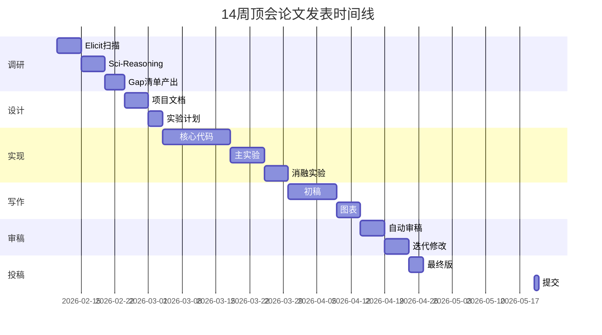
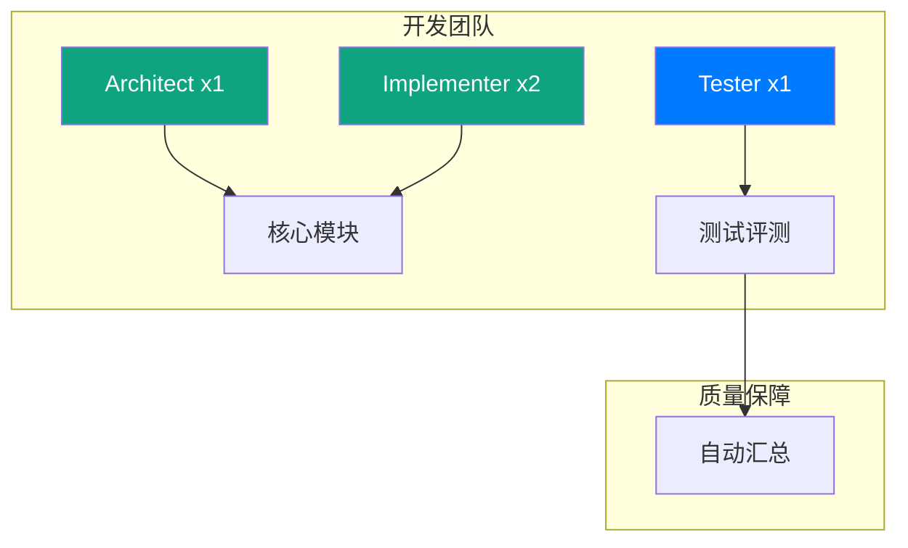

```mermaid
flowchart TD
    A[Claude Code 生成文档] --> B[GPT-5.2 审查]
    B --> C[人工Review]
    C --> D[确定实验计划]

    style A fill:#1a3a1a,stroke:#10a37f
    style B fill:#1a2a3a,stroke:#007aff
    style C fill:#b4b4b4,color:#212121
```

import { Card, CardGrid } from '@astrojs/starlight/components';

## 完整研究时间线



---

## Week 1-2: 调研阶段

### 目标
产出结构化的研究地图和空白清单

### 详细工作流


### 具体任务

1. **使用 Elicit** 扫描领域关键词（1-2天）
2. **使用 Semantic Scholar** 探索研究脉络（1-2天）
3. **使用 Sci-Reasoning** 分析创新模式（2-3天）
4. **整理研究地图**（2-3天）：
   - 问题子类分类
   - 方法范式分类
   - 评测基准整理

### 产出

| 产出物 | 说明 |
|-------|------|
| Research Gap 清单 | 10-20个候选方向 |
| Benchmark & Metric Sheet | 主流数据集和指标 |
| Assumption Matrix | 隐含假设分析 |

---

## Week 3: 项目设计

### 目标
确定研究问题和实验计划

### 详细工作流



### 具体任务

1. **生成项目文档**（使用 Claude Code，2-3天）
2. **审查文档**（使用 GPT-5.2 Pro，1天）：
   - claim-实验是否对齐？
   - baseline 是否足够强？
   - 是否有致命假设？
3. **确定实验计划**（1天）：
   - 主实验设计
   - 消融实验清单
   - 压力测试场景

### 产出

| 产出物 | 说明 |
|-------|------|
| 项目文档 | 20-30页详细文档 |
| 实验计划 | 主实验+消融+压力测试 |
| 里程碑时间表 | 每周任务分解 |

---

## Week 4-7: 代码实现 + 实验

### 目标
完成实现和主要实验

### 团队配置



### 具体任务

1. **并行开发**（Claude Code，2-3周）
2. **实验执行**（1周）：
   - 主实验：与 baseline 对比
   - 消融实验：每个模块贡献
   - 压力测试：边界条件
3. **结果汇总**（2-3天）

### 产出

| 产出物 | 说明 |
|-------|------|
| 可复现代码库 | 完整的实验代码 |
| 实验结果 | 主表+消融+分析 |
| 复现指南 | 便于他人复现 |

---

## Week 8-9: 论文写作

### 目标
完成论文初稿

### 写作流程


### 具体任务

1. **生成大纲**（Claude Opus 4.6，1天）
2. **并行写作**（多实例，5-7天）
3. **图表制作**（2-3天）

### 产出

| 产出物 | 说明 |
|-------|------|
| 论文初稿 | 8-10页正文 |
| 所有图表 | 方法图、结果图 |
| 补充材料 | 额外实验、细节 |

---

## Week 10: 审稿迭代

### 目标
通过多轮审稿迭代提升论文质量

### 审稿配置

| 轮次 | 模型 | 侧重点 |
|------|------|-------|
| 第1轮 | Claude Opus 4.6 | 整体逻辑 |
| 第2轮 | GPT-5.2 Pro | 技术细节 |
| 第3轮 | Gemini Pro | 可复现性 |

### 具体任务

1. **多模型并行审稿**（2天）
2. **交叉验证意见**（1天）
3. **批量修改**（2天）

### 产出

| 产出物 | 说明 |
|-------|------|
| 稳定投稿版本 | 准备提交 |
| 审稿意见记录 | 历史迭代 |
| 修改说明 | 响应记录 |

---

## Week 11: 投稿

### 检查清单

- [ ] 格式符合会议要求
- [ ] 页数在限制内
- [ ] 补充材料完整
- [ ] 作者信息正确
- [ ] 代码/数据链接有效

---

## Week 12+: Rebuttal

### Rebuttal 策略

| 意见类型 | 应对策略 |
|---------|---------|
| 可修复的 | 承诺修改，补充说明 |
| 误解的 | 礼貌澄清，补充证据 |
| 不同意但合理 | 讨论，引用支持文献 |
| 不同意的 | 坚定反驳，有理有据 |

---

## 时间线总览

```
Week 1-2:  ██████████████  调研
Week 3:    ██████          项目设计
Week 4-7: █████████████████████████  代码+实验
Week 8-9: ██████████████  写作
Week 10:  ██████████████  审稿迭代
Week 11:  ████            投稿
Week 12+: ██████████████  Rebuttal（如需要）
```

---

## 每日任务模板

### 工作日（周一至周五）

| 时间 | 任务 | 时长 |
|------|------|------|
| 09:00-10:00 | 计划与回顾 | 1h |
| 10:00-12:00 | 核心工作 | 2h |
| 14:00-17:00 | 深度工作 | 3h |
| 19:00-20:00 | 总结整理 | 1h |

### 周末

| 时间 | 任务 | 时长 |
|------|------|------|
| 10:00-12:00 | 论文写作 | 2h |
| 14:00-17:00 | 审稿迭代 | 3h |
| 19:00-20:00 | 周总结 | 1h |

---

<div class="tip">

**核心原则**：工具是辅助，核心是你的研究洞察力。让 AI 帮你处理重复性工作，把时间留给真正的思考。

</div>
