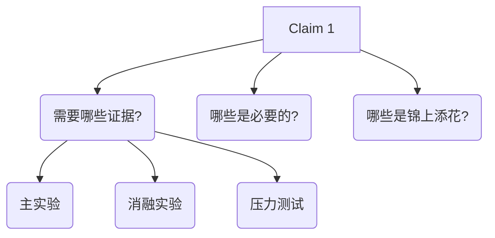

## 1. 写作核心原则

写作最核心的是：**让审稿人相信你的 claim**。

<div class="tip">

**核心流程**：论证链 → Outline → 文字生成

</div>

---

## 2. 构建论证链（不写正文）

先把论文的"论证链"写出来：



### 2.1 论证链示例

```
Claim 1: 我们的方法在低资源场景下优于baseline
├── 主实验: 在3个数据集上对比, 指标提升X%
├── 消融: 验证每个模块的贡献
└── 压力测试: 资源减少10%/50%/90%时的表现

Claim 2: 方法的关键创新是XXX机制
├── 消融: 去掉XXX后性能下降Y%
├── 可视化: 展示XXX激活模式
└── 理论分析: XXX为什么有效
```

---

## 3. 写 Outline（只写要点）

每小节回答一个问题：

| 问题 | 含义 |
|------|------|
| 这节要说服审稿人什么？ | 核心主张 |
| 审稿人可能质疑什么？ | 潜在反驳 |
| 我用什么证据挡住？ | 实验支撑 |

### 3.1 Outline 模板

```markdown
# 1. Introduction

## 要回答的问题
- 这个问题为什么重要？
- 现有方法有什么问题？
- 我们的核心贡献是什么？

## 可能的质疑
- "这个问题真的重要吗？"
  → 回答：用具体应用场景和数据说明
- "你们只是简单的组合吧？"
  → 回答：强调我们发现的XXX insight

## 关键证据
- 实验1: 在3个标准数据集上提升X%
- 实验2: 验证了XXX机制的必要性
```

---

## 4. 生成具体文字

最后再让模型生成具体文字：

**好处**：
- 不会空谈
- 每个观点都有支撑
- 逻辑清晰

---

## 5. MCP 工具与 Skills

### 5.1 MCP工具（文献搜索与访问）

| 工具 | 功能 | 适用场景 |
|------|------|---------|
| **Zotero-MCP** | 直接访问本地文献库 | 文献管理、引用分析 |
| **Perplexity MCP** | Deep Research 模式 | 技术调研、综述写作 |
| **ClickHouse MCP** | 数据库集成 | 大数据分析 |
| **Zen MCP** | 研究工作流 | 流程自动化 |
| **Paper Search MCP** | 多数据库搜索 | 快速获取新论文 |

### 5.2 Skills工具（科研分析与写作）

| 工具 | 技能数量 | 特色 |
|------|---------|------|
| **claude-scientific-skills** | 140+ | 即用型技能, 多领域覆盖 |
| **claude-scientific-writer** | - | 专注科研写作 |
| **Content-Research-Writer** | - | 长文协作写作 |
| **20-ml-paper-writing** | 77项 | 完整 ML 论文写作流程 |

### 5.3 GitHub 资源

- [claude-scientific-skills](https://github.com/K-Dense-AI/claude-scientific-skills)

---

## 6. 写作检查清单

<div class="card-grid">


每个 claim 都有对应的实验支撑


对比了所有强 baseline


叙事流畅, 无逻辑跳跃


全文使用统一的术语


引用格式正确, 来源可靠


图表有清晰的图例和说明


</div>
