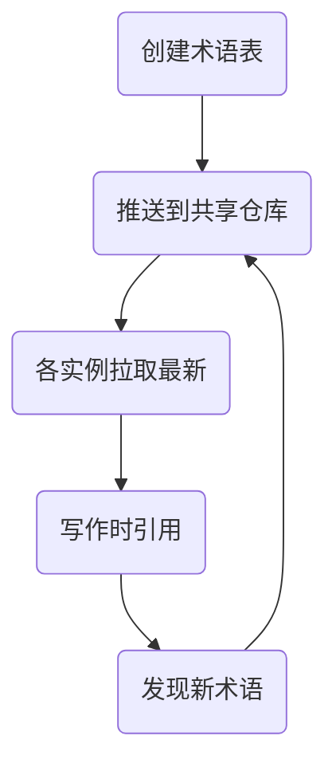

import { Card, CardGrid } from '@astrojs/starlight/components';

## 1. 多模型协作概览

```mermaid
flowchart TD
    subgraph ["写作流程"]
        A(大纲生成) --> B(分段写作)
        B --> C(一致性检查)
        C --> D(整合优化)
    end

    subgraph ["模型分工"]
        E[Claude Opus 4.6] --> A
        F[Claude Code] --> B
        G[GPT-5.2 Pro] --> C
        H[Gemini Pro] --> C
    end


```

---

## 2. AI-research-SKILLs

"20-ml-paper-writing"模块制定了严格规则：**绝不凭记忆生成引用**, 强制 5 步：


覆盖 AI 科研全流程的 **77 项技能**（20 个技术板块）。

---

## 3. tmux 工作流配置

让 Claude / GPT-5.2 / Gemini Pro 分工协作：

| tmux 实例 | 负责内容 | 模型选择 | 协作方式 |
|---------|---------|---------|---------|
| Instance 1 | Related Work | Claude Code | 文献梳理与对比 |
| Instance 2 | Method 写作 | Claude Code | 方法描述与形式化 |
| Instance 3 | 实验描述 | GPT-5.2 Pro | 实验设计和结果 |
| Instance 4 | 一致性校对 | Gemini Pro | 术语、符号统一 |

---

## 4. 协作写作流程

### 4.1 阶段 1: 大纲生成

使用 Claude Opus 4.6 生成长大纲（200K 上下文）

```markdown
# 论文大纲模板

## 1. Introduction (1.5页)
- 研究问题
- 核心挑战
- 你的贡献（3-4点）

## 2. Related Work (2页)
- 领域分类
- 主要方法
- 你的定位

## 3. Method (4页)
- 问题形式化
- 核心方法
- 技术细节

## 4. Experiments (3页)
- 实验设置
- 主结果
- 消融实验

## 5. Conclusion (0.5页)
- 总结
- 局限
- 未来方向
```

### 4.2 阶段 2: 分段写作

各实例并行处理不同章节：

```bash
# tmux 窗口布局
# =================
# 窗口 1: Related Work
# 窗口 2: Method
# 窗口 3: Experiments
# 窗口 4: Introduction/Conclusion
# 窗口 5: 整合校对
```

### 4.3 阶段 3: 一致性检查

使用专门实例校对一致性：

| 检查项 | 工具 | 说明 |
|-------|------|------|
| 术语一致性 | Claude Code | 统一术语使用 |
| 符号一致性 | GPT-5.2 Pro | 数学符号检查 |
| 引用格式 | Gemini Pro | BibTeX 格式 |

### 4.4 阶段 4: 整合优化

由最强模型整合所有内容, 确保叙事流畅。

---

## 5. 术语表管理

### 5.1 术语表示例

```markdown
# 术语表 (GLOSSARY.md)

| 中文 | 英文 | 缩写 | 定义 |
|------|------|------|------|
| 注意力机制 | Attention Mechanism | Attn | ... |
| 多头注意力 | Multi-Head Attention | MHA | ... |
| 自注意力 | Self-Attention | SA | ... |
```

### 5.2 共享术语表工作流



### 5.3 使用建议

<div class="card-grid">


单一文件管理所有术语, 避免分散


使用 Git 追踪变更, 可回滚


各实例定期更新术语表


建立术语决策流程


</div>

---

## 6. 会议特定建议

| 会议 | 偏好 | 写作建议 |
|------|------|---------|
| **NeurIPS** | 神经科学结合 | 强调方法的生物学合理性 |
| **ICML** | 理论基础 | 增加理论分析和证明 |
| **ICLR** | 表示学习 | 侧重表示分析和可视化 |
| **CVPR** | 实验完整性 | 充分的消融和对比实验 |
| **ACL/EMNLP** | 语言学洞察 | 增加定性分析和案例分析 |

---

## 7. 常见写作误区

<div class="warning">

❌ **"像论文但没信息"** - 缺乏实质贡献

❌ **过度声明** - claim 超出实验支持

❌ **忽略关键 baseline** - 对比不充分

❌ **叙事不清** - 逻辑跳跃

</div>

---

## 8. 协作检查清单

- [ ] 术语表已创建并同步
- [ ] 各章节使用统一格式
- [ ] 引用已验证
- [ ] 符号系统一致
- [ ] 叙事逻辑连贯
- [ ] 实验claim对齐
